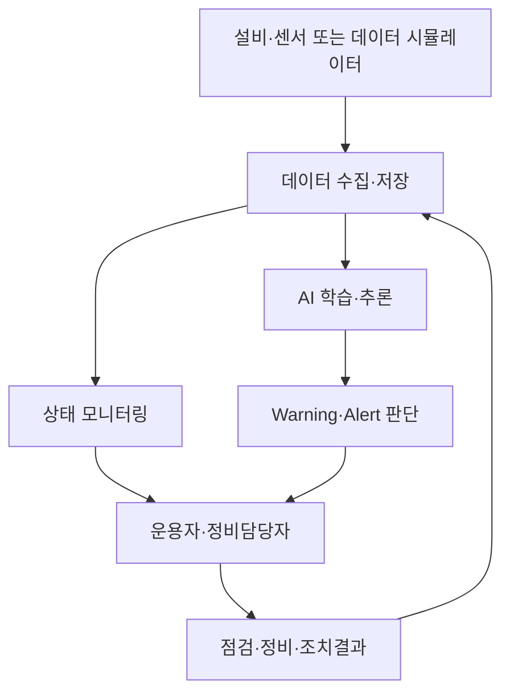
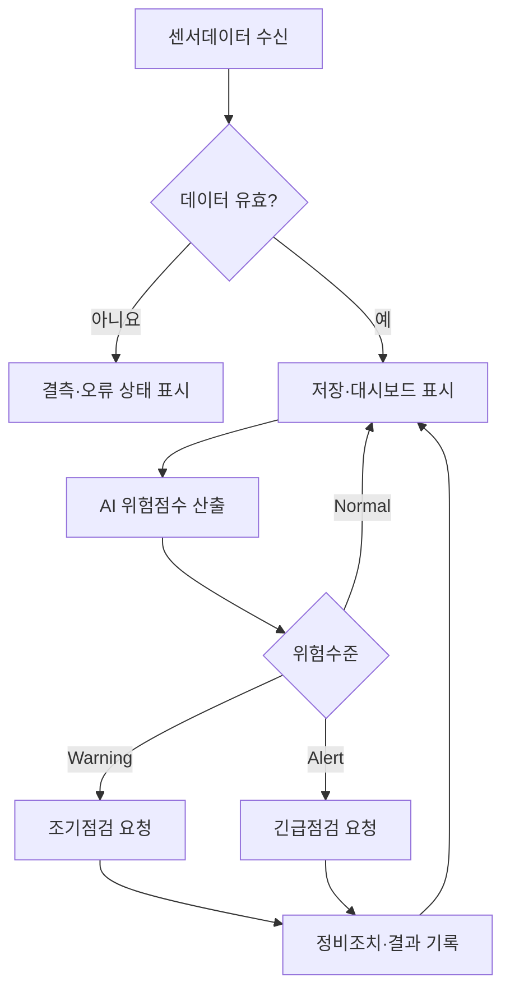

# 설비 상태 모니터링 및 AI 기반 예지보전 시스템 프로젝트 정의서

## 문서관리 정보

| 항목 | 내용 |
|---|---|
| 프로젝트명 | 설비 상태 모니터링 및 AI 기반 예지보전 시스템 |
| 문서명 | 프로젝트 정의서 |
| 관련 Issue | Issue #2 — 프로젝트 개요·배경·문제 정의·목표 및 범위 정의 |
| 문서 경로 | `docs/02-project-definition/project-definition.md` |
| 작업 Branch | `docs/2-project-definition` |
| PR 대상 Branch | `develop` |
| 문서 버전 | v0.1 |
| 문서 상태 | 초안 / Product Owner 검토 대상 |
| 개발방식 | Scrum 기반 Agile 개발 |
| 작성일 | 2026-08-11 |
| 작성자 | 프로젝트 수행팀 |
| 검토자 | Product Owner / 교수자 |

> 본 문서는 프로젝트의 최초 기준선을 제공하는 Living Document이다. Sprint Review에서 프로젝트 범위, 사용자 가치 또는 기술적 가정이 변경되면 관련 GitHub Issue와 변경근거를 기록하고 본 문서를 갱신한다.

---

## 1. 문서 목적

본 문서는 설비 상태 모니터링 및 AI 기반 예지보전 시스템의 개발 필요성과 해결할 문제를 명확히 하고, 프로젝트의 목표, MVP 범위, 시스템 경계, 상위 운용개념 및 성공기준을 정의하는 것을 목적으로 한다.

본 문서의 결과는 다음 활동의 입력자료로 사용한다.

- User Class와 상세 운용 시나리오 정의
- 기능·AI·데이터·인터페이스·비기능 요구사항 작성
- 시스템 아키텍처 설계
- 시스템 계층별 OSS 후보군 조사와 평가
- AI 학습데이터 준비, 모델 개발 및 성능평가
- 통합시험, 사용자 시연 및 프로젝트 완료평가

---

## 2. 프로젝트 요약

본 프로젝트는 제조설비 또는 교육용 모의설비에서 생성되는 온도, 진동, 전류 등의 센서데이터를 지속적으로 수집·저장·분석하여 현재 설비상태를 시각화하고, AI 모델을 이용하여 고장징후를 사전에 예측하는 교육용 MVP를 개발한다.

AI가 정상상태와 다른 징후를 탐지하면 시스템은 위험수준을 Normal, Warning, Alert로 구분하여 표시한다. 운용자는 경보를 확인하고 정비담당자에게 점검을 요청하며, 정비담당자는 점검·조치 결과를 기록한다. 이러한 일련의 과정을 통해 단순한 센서 모니터링을 넘어 **데이터 수집 → AI 예측 → 경보 → 조기 대응 → 결과 기록**으로 이어지는 폐루프 예지보전 흐름을 구현한다.

### 한 문장 프로젝트 정의

> OSS 기반 데이터·모니터링 기술과 직접 개발한 AI 고장징후 예측모델을 통합하여, 설비 이상을 조기에 탐지하고 Warning/Alert 및 정비 대응으로 연결하는 예지보전 MVP를 구축한다.

---

## 3. 추진 배경

### 3.1 설비운영 환경의 변화

제조설비는 자동화·연결화가 진행되면서 다수의 센서와 제어장치에서 대량의 운용데이터를 생성한다. 그러나 데이터가 단순 저장되거나 개별 화면에 표시되는 수준에 머무르면 설비의 열화 추세와 고장징후를 조기에 발견하기 어렵다.

### 3.2 사후정비의 한계

설비 고장 후에 정비하는 사후정비 방식은 예상하지 못한 가동중단, 생산손실, 긴급정비 비용 및 안전위험을 초래할 수 있다. 반대로 설비상태와 관계없이 일정 주기로 부품을 교체하는 예방정비 방식은 사용 가능한 부품을 조기에 교체하거나 불필요한 점검을 수행할 가능성이 있다.

### 3.3 데이터 기반 예지보전의 필요성

센서데이터의 시간적 변화와 복합적인 패턴을 AI로 분석하면 임계값 규칙만으로 찾기 어려운 초기 이상징후를 탐지할 수 있다. 예측결과를 운용자와 정비담당자에게 이해할 수 있는 경보와 조치정보로 제공하면 계획정비와 조기대응이 가능하다.

### 3.4 OSS 활용 필요성

데이터 수집, 메시징, 시계열 저장, 시각화, AI 학습 및 운영에는 다양한 기술이 필요하다. 검증된 OSS를 체계적으로 조사·평가·선정하면 제한된 교육기간 안에 시스템을 구현하면서도 라이선스, 보안, 유지보수성 및 확장성을 학습할 수 있다.

### 3.5 교육적 필요성

본 과제는 다음 역량을 통합적으로 학습하는 교수자 시범과제이다.

- User Class 기반 요구사항 정의
- GitHub Issue, Project, Branch, Pull Request 기반 협업
- 시스템 아키텍처와 계층별 OSS 구성
- OSS 검색, 비교평가, 라이선스 및 보안검토
- 센서데이터 처리와 AI 모델 개발
- AI 모델의 실제 시스템 적용
- 사용자 경보 및 조기대응 흐름 구현
- 요구사항부터 시험결과까지의 추적성 관리

---

## 4. 현행 상태와 문제 정의

### 4.1 가정한 현행 상태(AS-IS)

교육용 대상설비는 온도, 진동, 전류 등의 센서값을 발생시키지만 다음과 같은 상태에 있다고 가정한다.

- 센서데이터가 여러 장치 또는 파일에 분산되어 있다.
- 현재값은 확인할 수 있으나 장기간 추세를 통합적으로 보기 어렵다.
- 경보가 단순한 고정 임계값을 기준으로 발생한다.
- 복수 센서의 결합 패턴과 시간적 변화를 이용한 고장징후 예측이 없다.
- 경보 발생 후 확인, 정비요청, 조치완료 과정이 체계적으로 기록되지 않는다.
- 데이터, 예측결과, 경보 및 정비이력 간 추적성이 부족하다.

### 4.2 핵심 문제

> 설비에서 센서데이터가 발생하고 있음에도 이를 통합적으로 수집·분석하여 고장징후를 조기에 예측하고, 예측결과를 실제 경보와 정비 조치로 연결하는 체계가 부족하다.

### 4.3 세부 문제와 영향

| 문제 ID | 세부 문제 | 운용상 영향 |
|---|---|---|
| PRB-01 | 센서데이터의 분산 및 실시간 가시성 부족 | 운용자가 설비의 현재 상태와 변화추세를 신속히 파악하기 어려움 |
| PRB-02 | 고정 임계값 중심의 단순 경보 | 초기 열화 또는 여러 센서의 복합 이상징후를 놓칠 수 있음 |
| PRB-03 | 고장징후 예측기능 부재 | 사전점검 기회를 상실하고 돌발고장 가능성이 증가함 |
| PRB-04 | 경보의 근거정보 부족 | 운용자와 정비담당자가 경보의 신뢰성과 우선순위를 판단하기 어려움 |
| PRB-05 | 경보와 정비조치 간 연계 부족 | 경보가 실제 점검·정비로 연결되었는지 확인하기 어려움 |
| PRB-06 | 데이터·모델·경보 버전 추적 부족 | AI 예측결과의 재현성과 검증 가능성이 저하됨 |
| PRB-07 | OSS 선정기준과 검증 부족 | 기능 부적합, 라이선스 충돌, 보안취약점 및 통합 실패 위험이 존재함 |

### 4.4 해결해야 할 핵심 질문

1. 설비 센서데이터를 신뢰성 있게 수집·저장·조회할 수 있는가?
2. 운용자가 현재 상태와 변화추세를 쉽게 파악할 수 있는가?
3. AI가 고장징후를 의미 있는 정확도와 조기성으로 예측할 수 있는가?
4. 예측결과가 Warning/Alert와 정비대응 절차로 연결되는가?
5. 사용한 OSS가 기능, 품질, 라이선스, 보안 및 유지관리 측면에서 과제에 적합한가?
6. 데이터, 모델, 예측, 경보 및 조치결과가 추적 가능한가?

---

## 5. 목표 시스템의 개념(TO-BE)

목표 시스템은 센서데이터를 지속적으로 수집하여 실시간 상태와 이력을 제공하고, AI 모델을 통해 고장징후와 위험도를 예측한다. 예측결과는 경보관리 기능을 통해 운용자와 정비담당자에게 제공되며, 사용자는 경보 확인부터 정비조치 완료까지의 상태를 관리한다.



### 목표 운용상태

- 설비와 센서의 연결상태를 확인할 수 있다.
- 현재 센서값과 과거 변화추세를 조회할 수 있다.
- AI가 입력데이터를 분석하여 고장징후 위험점수를 산출한다.
- 설비상태를 Normal, Warning, Alert로 구분한다.
- 경보와 함께 관련 센서값, 발생시각, 위험점수 및 권고조치를 제공한다.
- 경보 확인, 정비요청, 조치중, 조치완료 상태를 기록한다.
- 데이터, 모델 버전, 예측결과, 경보 및 조치이력을 추적한다.

---

## 6. 프로젝트 목표

### OBJ-01 센서데이터 통합

교육용 대상설비 또는 데이터 시뮬레이터에서 최소 3종의 센서데이터를 수집·저장하고 현재값과 이력을 조회할 수 있도록 한다.

### OBJ-02 설비상태 가시화

운용자가 설비별 현재 상태, 센서 추세, 최근 경보 및 연결상태를 하나의 대시보드에서 확인할 수 있도록 한다.

### OBJ-03 AI 고장징후 예측모델 개발

프로젝트 팀이 직접 데이터 전처리, 특징 생성, 학습, 평가 및 모델 선정을 수행하여 최소 1개의 기준모델과 1개의 비교모델을 개발한다.

### OBJ-04 AI 모델 시스템 적용

선정된 AI 모델을 추론서비스에 적용하여 새로운 센서데이터에 대한 위험점수와 상태를 산출한다.

### OBJ-05 경보 및 조기대응 구현

AI 예측결과와 운용규칙을 기반으로 Warning/Alert를 발생시키고, 운용자 확인부터 정비조치 완료까지의 업무흐름을 구현한다.

### OBJ-06 체계적인 OSS 선정

시스템 계층별 OSS 후보를 조사하고 기능, 성능, 통합성, 라이선스, 보안, 커뮤니티 및 유지관리 상태를 평가하여 최종 OSS를 선정한다.

### OBJ-07 검증과 추적성 확보

상위 목표, User Story, 요구사항, 아키텍처 구성요소, OSS, 구현 및 시험결과 간의 추적성을 확보한다.

---

## 7. 정량적 성공목표

아래 값은 프로젝트 수준의 초기 목표이며 Issue #4 요구사항 정의와 Sprint Planning에서 데이터 특성 및 교육환경을 확인한 후 Product Owner의 승인을 받아 조정할 수 있다.

| 목표 ID | 측정항목 | 초기 목표값 | 검증방법 |
|---|---|---:|---|
| KPI-01 | 처리 가능한 센서 종류 | 3종 이상 | 데이터 입력·화면 확인 |
| KPI-02 | 센서메시지 처리량 | 초당 100건 이상 | 부하시험 |
| KPI-03 | 데이터 수집 후 화면 표시 지연 | p95 5초 이하 | 타임스탬프 비교 |
| KPI-04 | 센서연결 중단 표시 | 중단 후 30초 이내 | 연결중단 시험 |
| KPI-05 | AI 최종모델 F1-score | 0.85 이상 목표 | 분리된 시험데이터 평가 |
| KPI-06 | 고장징후 Recall | 0.90 이상 목표 | 혼동행렬 평가 |
| KPI-07 | False Positive Rate | 10% 이하 목표 | 혼동행렬 평가 |
| KPI-08 | AI 추론 후 경보 표시 지연 | p95 3초 이하 | 통합 지연시간 측정 |
| KPI-09 | 조기 Warning 시점 | 적합한 데이터 확보 시 고장 10분 전 목표 | 고장시점 대비 탐지시점 비교 |
| KPI-10 | 연속운전 안정성 | 24시간 동안 치명적 장애 0건 | 연속운전시험 |
| KPI-11 | 경보·조치이력 추적 | 시험 경보의 100% 기록 | DB·화면·로그 확인 |
| KPI-12 | OSS 라이선스 식별 | 사용 OSS의 100% | OSS 목록·라이선스 검토 |
| KPI-13 | 미조치 보안취약점 | Critical·High 0건 | 취약점 점검결과 확인 |

> AI 성능은 데이터셋의 불균형, 고장 라벨 품질과 시간정보에 영향을 받는다. 목표 미달 시 수치를 임의로 낮추지 않고 원인, 실험조건, 개선결과 및 잔여 위험을 기록하여 Product Owner가 MVP 수용 여부를 판단한다.

---

## 8. 프로젝트 범위

### 8.1 포함범위(In Scope)

#### 데이터 수집·관리

- 설비 또는 데이터 시뮬레이터의 센서데이터 입력
- 최소 3종의 센서데이터 처리
- 데이터 유효성 확인, 결측 및 이상치 처리
- 시계열 데이터 저장과 기간별 조회
- 데이터 출처, 수집시각 및 설비 식별정보 관리

#### 상태 모니터링

- 설비별 현재 센서값 표시
- 시간대별 변화추세 시각화
- 설비상태 및 센서 연결상태 표시
- 최근 Warning/Alert와 경보이력 조회

#### AI 개발·운영

- 공개 또는 교육용 예지보전 데이터 확보
- 데이터 탐색, 전처리, 특징 생성 및 학습·시험 데이터 분리
- 기준모델과 비교모델 개발
- Accuracy, Precision, Recall, F1-score 및 False Positive Rate 평가
- 최종모델 선정과 버전관리
- 추론 API 또는 서비스 구현
- 실시간 또는 준실시간 센서데이터에 대한 위험점수 산출

#### 경보·대응

- Normal, Warning, Alert 상태 구분
- 설비 ID, 발생시각, 위험도, 관련 센서값 및 권고조치 표시
- 경보 확인, 정비요청, 조치중, 조치완료 상태관리
- 정비담당자 조치내용과 완료시각 기록
- 경보와 조치이력 조회

#### OSS 선정·검증

- 시스템 계층별 OSS 후보군 조사
- 기능·성능·통합·문서·커뮤니티·라이선스·보안 평가
- 핵심 후보의 최소 PoC
- 최종 OSS와 선정근거 문서화
- OSS 명칭, 버전, 출처, 라이선스 및 의무사항 기록

#### 시험·산출물

- 기능시험, AI 성능평가, 인터페이스시험 및 통합시험
- 정량 비기능 목표 검증
- 사용자 시연
- GitHub Issue·PR·Review 및 시험결과 기록
- 최종보고서와 향후 보완사항 작성

### 8.2 제외범위(Out of Scope)

- 실제 생산설비 제어 또는 안전정지 기능
- AI 판단만으로 설비를 자동 정지하거나 제어하는 기능
- 상용공장 전체 설비로의 현장배포와 인증
- ERP, MES, CMMS와의 완전한 실운영 연동
- 다수 사업장과 수천 대 설비를 위한 대규모 확장
- 모바일 전용 애플리케이션
- SMS, 전화, 상용 메신저를 이용한 실제 외부 알림
- 완전 자동화된 MLOps와 무중단 재학습
- 장기간 현장실증을 통한 경제성 검증
- 고장원인에 대한 법적·안전 인증 수준의 설명가능성 보증

### 8.3 향후 확장 가능범위

- 실제 산업용 프로토콜과 Edge Gateway 연동
- ERP·MES·CMMS 정비작업지시 연동
- 이메일·SMS·모바일 Push 알림
- 다중설비·다중공장 확장
- 모델 성능감시와 자동 재학습
- Edge AI 기반 현장 추론
- 설비의 잔여수명(RUL) 예측
- Digital Twin 연계

---

## 9. 시스템 경계

### 9.1 시스템 내부

- 센서데이터 수집 어댑터 또는 데이터 시뮬레이터
- 메시지 전달 및 데이터 수집 기능
- 시계열 데이터 저장소
- 설비상태 모니터링 대시보드
- 데이터 전처리와 학습데이터 관리 기능
- AI 모델 학습·평가 기능
- AI 추론서비스
- 경보판정 및 Warning/Alert 관리 기능
- 사용자 확인·정비조치 기록 기능
- 로그, 사용자 및 시스템 설정 기능

### 9.2 시스템 외부

- 실제 설비와 물리센서
- 외부 공개 예지보전 데이터셋 제공처
- 외부 ERP·MES·CMMS
- 실제 이메일·SMS·모바일 알림서비스
- 실제 설비 안전제어 및 비상정지장치

### 9.3 주요 외부 인터페이스

| 인터페이스 ID | 외부 대상 | 입력·출력 | 초기 적용수준 |
|---|---|---|---|
| IF-01 | 설비·센서 또는 시뮬레이터 | 센서값, 설비 ID, 측정시각 입력 | MVP 적용 |
| IF-02 | 공개 학습데이터 | 센서·상태·고장 라벨 입력 | MVP 적용 |
| IF-03 | 사용자 Web Browser | 대시보드, 경보 및 조치정보 입출력 | MVP 적용 |
| IF-04 | 외부 정비시스템 | 정비요청 및 처리결과 | 모의 인터페이스 또는 향후 확장 |
| IF-05 | 외부 알림서비스 | Warning/Alert 메시지 출력 | 화면 알림까지만 MVP 적용 |

---

## 10. 상위 운용개념

### 10.1 정상상태 모니터링

1. 설비 또는 데이터 시뮬레이터가 센서데이터를 생성한다.
2. 시스템이 데이터를 수집하고 유효성을 확인한다.
3. 유효한 데이터를 시계열 저장소에 저장한다.
4. 운용자는 대시보드에서 현재값과 변화추세를 확인한다.
5. AI 추론서비스는 위험점수를 계산한다.
6. 위험도가 정상범위이면 시스템은 Normal 상태를 유지한다.

### 10.2 Warning 발생과 조기점검

1. 복수 센서의 변화패턴에서 초기 고장징후가 탐지된다.
2. AI 모델이 Warning 기준 이상의 위험점수를 산출한다.
3. 시스템은 Warning과 근거정보 및 권고조치를 표시한다.
4. 운용자는 Warning을 확인하고 정비담당자에게 점검을 요청한다.
5. 정비담당자는 설비상태를 점검하고 결과를 기록한다.
6. 위험이 해소되면 상태를 Normal로 변경하고 조치이력을 보존한다.

### 10.3 Alert 발생과 긴급대응

1. 위험점수가 Alert 기준을 초과하거나 주요 센서값이 위험수준에 도달한다.
2. 시스템은 Alert를 우선순위가 높은 경보로 표시한다.
3. 운용자는 현장 안전절차에 따라 설비상태를 확인한다.
4. 정비담당자는 긴급점검과 필요한 조치를 수행한다.
5. 사용자는 경보 확인, 조치중, 조치완료 상태를 기록한다.
6. 시스템은 발생부터 완료까지의 모든 이력을 저장한다.

> 본 MVP는 운용자에게 경보와 권고정보를 제공하지만 설비를 직접 자동 정지시키지 않는다. 실제 정지 또는 제어는 승인된 현장 안전절차와 별도 안전제어장치에 따른다.

### 10.4 센서 또는 통신장애 대응

1. 시스템이 설정된 시간 동안 센서데이터를 수신하지 못한다.
2. 해당 센서를 `Disconnected` 또는 `Data Missing` 상태로 표시한다.
3. 신뢰할 수 없는 데이터에 대해서는 AI 추론 또는 경보발생을 제한한다.
4. 운용자는 센서, 네트워크 또는 데이터 수집기 상태를 점검한다.
5. 연결 복구 후 데이터 수집과 AI 추론을 재개한다.

### 10.5 AI 모델 갱신

1. AI 담당자가 새로운 학습데이터와 기존 모델 성능을 검토한다.
2. 후보모델을 재학습하고 기존모델과 동일 조건으로 비교한다.
3. 인수기준을 만족한 모델만 승인 후보로 등록한다.
4. 승인된 모델에 버전을 부여하고 추론서비스에 적용한다.
5. 배포 전후 모델 버전과 성능지표를 기록한다.
6. 문제가 발생하면 이전 승인모델로 복구할 수 있도록 한다.

---

## 11. 상위 업무 흐름



---

## 12. 주요 이해관계자와 기대가치

본 절에서는 프로젝트 경계를 결정하기 위한 상위 수준의 이해관계자만 식별한다. User Class의 특성, 권한, 빈도, 숙련도 및 상세 요구는 Issue #3에서 정의한다.

| 이해관계자 | 주요 관심사항 | 기대가치 |
|---|---|---|
| 설비 운용자 | 현재상태, 경보, 빠른 인지 | 이상상태를 신속하게 확인 |
| 정비담당자 | 고장징후, 점검 우선순위, 조치이력 | 고장 전에 계획적으로 점검·정비 |
| 생산관리자 | 가동상태, 경보현황, 중단 위험 | 돌발중단 위험과 운영영향 감소 |
| 데이터·AI 담당자 | 데이터 품질, 모델성능, 버전 | 재현 가능한 모델 개발·평가·배포 |
| 시스템 관리자 | 사용자, 보안, 로그, 시스템상태 | 안정적이고 추적 가능한 시스템 운영 |
| Product Owner/교수자 | 사용자 가치, 교육목표, MVP 완료 | OSS와 AI 개발방법의 전 과정 검증 |
| 개발팀 | 명확한 Backlog, 인터페이스, 완료기준 | Sprint마다 검증 가능한 Increment 제공 |

---

## 13. 핵심 비즈니스 규칙

| 규칙 ID | 규칙 |
|---|---|
| BR-01 | 모든 센서데이터는 설비 ID, 센서 ID, 측정시각과 함께 저장한다. |
| BR-02 | AI 예측결과에는 사용한 모델 버전과 추론시각을 기록한다. |
| BR-03 | 센서데이터가 유효하지 않으면 AI 예측결과의 신뢰상태를 표시한다. |
| BR-04 | Warning과 Alert의 판정기준은 서로 구분하여 관리한다. |
| BR-05 | 경보에는 발생원인 판단에 필요한 센서값과 위험점수를 포함한다. |
| BR-06 | 경보의 상태변경에는 수행자, 변경시각 및 조치내용을 기록한다. |
| BR-07 | AI 경보는 정비 의사결정을 지원하며 안전제어를 직접 수행하지 않는다. |
| BR-08 | 새 AI 모델은 승인된 평가절차를 통과한 후에만 운영 추론에 사용한다. |
| BR-09 | 사용 OSS의 버전, 출처, 라이선스 및 수정 여부를 기록한다. |
| BR-10 | Critical 또는 High 취약점이 발견된 OSS는 완화조치 또는 교체결정 없이 Release에 포함하지 않는다. |

---

## 14. 데이터 및 AI 적용 개념

### 14.1 데이터 유형

- 설비 식별정보: 설비 ID, 설비 종류, 설치위치
- 센서정보: 센서 ID, 센서 종류, 단위, 수집주기
- 측정데이터: 온도, 진동, 전류 등 센서값과 측정시각
- 상태정보: 정상, 열화, 고장 또는 고장유형 라벨
- 예측정보: 위험점수, 예측상태, 모델 버전, 추론시각
- 경보정보: 경보 ID, 수준, 발생시각, 관련 센서값, 권고조치
- 정비정보: 담당자, 확인시각, 조치내용, 완료시각, 결과

### 14.2 AI 개발 범위

1. 데이터 탐색과 품질분석
2. 결측·이상치 처리와 데이터 정규화
3. 학습·검증·시험 데이터 분리
4. 기준모델 개발
5. 후보모델 개발과 비교평가
6. 모델 성능과 오류사례 분석
7. 최종모델 선정과 버전관리
8. 추론 API 또는 서비스 구현
9. 모니터링·경보 기능과 통합
10. 통합환경에서 성능과 지연시간 검증

### 14.3 AI 적용 원칙

- 학습데이터와 시험데이터의 정보누출을 방지한다.
- 데이터 불균형을 고려하여 Accuracy만으로 모델을 평가하지 않는다.
- Recall, Precision, F1-score, False Positive Rate와 혼동행렬을 함께 사용한다.
- 시계열 데이터의 경우 시간순서를 고려하여 데이터 분할을 수행한다.
- 모델이 산출한 결과는 경보근거와 함께 기록한다.
- AI 성능 미달 또는 데이터 한계는 숨기지 않고 잔여 위험으로 관리한다.
- AI 판단은 운용자와 정비담당자의 의사결정을 지원하며 최종 안전판단을 대체하지 않는다.

---

## 15. 가정사항

| 가정 ID | 가정사항 |
|---|---|
| ASM-01 | 교육목적에 사용할 수 있는 공개 또는 모의 예지보전 데이터가 확보된다. |
| ASM-02 | 센서데이터에는 설비와 측정시각을 식별할 수 있는 정보가 포함된다. |
| ASM-03 | 실제 설비가 없어도 데이터 재생 또는 시뮬레이터로 실시간 흐름을 재현할 수 있다. |
| ASM-04 | 개발팀은 GitHub Repository와 개발환경을 사용할 수 있다. |
| ASM-05 | 필요한 OSS를 설치·실행할 수 있는 PC 또는 서버 자원이 제공된다. |
| ASM-06 | Product Owner 또는 교수자가 각 Sprint Review에 참여한다. |
| ASM-07 | 외부 SMS·이메일과 실제 설비제어는 화면 모의기능으로 대체할 수 있다. |

---

## 16. 제약조건

| 제약 ID | 제약조건 | 영향 |
|---|---|---|
| CON-01 | 전체 수행기간은 10주이다. | MVP 중심으로 범위를 제한해야 함 |
| CON-02 | 개발팀에 비전공자가 포함될 수 있다. | 설치, 실행, 시험절차를 문서화해야 함 |
| CON-03 | 실제 고장데이터가 부족할 수 있다. | 공개데이터·모의데이터와 이상탐지 방식 검토 필요 |
| CON-04 | 실제 생산설비에 직접 연결하지 않는다. | 데이터 시뮬레이터와 재생기능이 필요함 |
| CON-05 | OSS 중심으로 구현한다. | 라이선스, 보안, 호환성 및 커뮤니티 평가가 필요함 |
| CON-06 | 고비용 상용서비스 사용을 최소화한다. | 로컬 실행 또는 무료 범위의 도구를 우선 검토함 |
| CON-07 | AI 모델을 직접 개발·학습·평가해야 한다. | 완성된 외부 예측 API만 사용하는 방식은 허용하지 않음 |
| CON-08 | 모든 변경은 GitHub PR Review를 거친다. | Branch와 형상관리 절차 준수 필요 |

---

## 17. 초기 위험

| 위험 ID | 위험요인 | 가능성 | 영향도 | 초기 대응방향 |
|---|---|---:|---:|---|
| RSK-01 | 고장 라벨 데이터 부족 | 높음 | 높음 | 공개데이터 조사, 이상탐지 방식 병행, 데이터 적합성 Spike 수행 |
| RSK-02 | 데이터 결측·노이즈 | 중간 | 높음 | 데이터 품질규칙과 전처리 Pipeline 구현 |
| RSK-03 | AI 성능목표 미달 | 중간 | 높음 | 기준모델 조기개발, 오류분석, 특징 및 알고리즘 반복개선 |
| RSK-04 | 경보 오탐·미탐 | 중간 | 높음 | Warning·Alert 분리, 임계값 조정, 사용자 Review 반영 |
| RSK-05 | OSS 통합 실패 | 중간 | 높음 | 핵심 후보를 PoC로 조기검증하고 대체후보 유지 |
| RSK-06 | OSS 라이선스 부적합 | 낮음 | 높음 | 배포방식 기준 라이선스 의무사항 검토 |
| RSK-07 | OSS 보안취약점 | 중간 | 높음 | 취약점 검색, 버전 고정, 패치 또는 대체 OSS 선정 |
| RSK-08 | 10주 내 범위 초과 | 중간 | 높음 | Must 기능 우선, Sprint Review에서 범위 재조정 |

---

## 18. 프로젝트 성공 및 수용기준

다음 조건을 모두 만족하면 MVP가 프로젝트 목표를 달성한 것으로 판단한다.

- [ ] 최소 3종의 센서데이터가 시스템으로 입력되고 저장·조회된다.
- [ ] 대시보드에서 현재값, 추세, 연결상태 및 설비상태를 확인할 수 있다.
- [ ] 기준모델과 비교모델을 직접 개발하고 동일 조건으로 평가하였다.
- [ ] 선정된 AI 모델이 추론서비스에 배포되어 새로운 데이터에 대한 결과를 산출한다.
- [ ] AI 예측결과가 Normal, Warning, Alert 상태로 화면에 표시된다.
- [ ] Warning/Alert에서 운용자 확인, 정비요청 및 조치완료까지 기록된다.
- [ ] 정량적 KPI의 시험결과와 미달항목의 원인·잔여 위험이 문서화되어 있다.
- [ ] 사용 OSS의 선정근거, 버전, 출처, 라이선스 및 보안검토 결과가 기록되어 있다.
- [ ] 기능·AI·비기능 요구사항과 시험결과의 추적성이 확보되어 있다.
- [ ] `develop` 통합시험과 최종 사용자 시연이 완료되어 있다.
- [ ] Product Owner가 Release 1.0 MVP를 수용하였다.

---

## 19. Agile Backlog 반영사항

본 프로젝트 정의에 따라 다음 항목을 Product Backlog에 반영한다.

| Backlog 후보 | 사용자 가치 | 우선순위 |
|---|---|---:|
| 센서데이터 수집 | 설비상태의 실시간 파악 기반 제공 | Must |
| 시계열 저장·조회 | 변화추세와 AI 학습데이터 확보 | Must |
| 설비상태 대시보드 | 운용자의 신속한 상태 인지 | Must |
| 데이터 품질관리 | 신뢰할 수 있는 AI 입력 확보 | Must |
| 계층별 OSS PoC | 통합 및 라이선스 위험 조기감소 | Must |
| AI 기준모델 개발 | 예측성능 비교 기준 확보 | Must |
| AI 모델 개선·선정 | 신뢰할 수 있는 고장징후 예측 | Must |
| 실시간 AI 추론 | 모니터링 데이터에 예측 적용 | Must |
| Warning·Alert 관리 | 위험수준에 따른 조기경보 | Must |
| 정비대응 이력 | 경보를 실제 조치로 연결 | Should |
| 성능·보안·신뢰성 검증 | 안정적 MVP Release | Must |
| 최종 통합·시연 | 사용자 가치와 목표 달성 확인 | Must |

각 Backlog 후보는 Issue #3과 #4에서 User Class, User Story 및 상세 Acceptance Criteria를 보완한 후 실제 GitHub Issue로 등록한다.

---

## 20. 미결사항 및 후속 의사결정

| 결정 ID | 미결사항 | 결정 목표시점 | 처리방법 |
|---|---|---|---|
| DEC-01 | 교육용 기준 데이터셋 | Sprint 1 Planning | 데이터 적합성 Spike 결과로 결정 |
| DEC-02 | 센서데이터 입력방식 | Sprint 1 | 파일 재생·시뮬레이터·메시징 방식 비교 |
| DEC-03 | 계층별 OSS 구성 | Sprint 2 이전 | Long List, Short List 및 PoC 평가 |
| DEC-04 | AI 문제유형 | Sprint 2 Review | 분류·이상탐지·RUL 중 데이터 적합성을 기준으로 결정 |
| DEC-05 | Warning·Alert 임계값 | Sprint 4 | 모델 성능과 사용자 Review 결과로 결정 |
| DEC-06 | 외부 알림 모의범위 | Sprint 4 | 일정과 MVP 우선순위를 기준으로 결정 |

---

## 21. Issue #2 완료 체크리스트

- [ ] 프로젝트 개요와 추진배경이 작성되어 있다.
- [ ] AS-IS 상태와 핵심 문제가 정의되어 있다.
- [ ] TO-BE 시스템 개념과 프로젝트 목표가 정의되어 있다.
- [ ] 포함범위, 제외범위 및 향후 확장범위가 구분되어 있다.
- [ ] 시스템 내부·외부 경계와 주요 인터페이스가 식별되어 있다.
- [ ] 정상, Warning, Alert, 센서장애 및 모델갱신 시나리오가 작성되어 있다.
- [ ] 정량적 성공목표와 검증방법이 제시되어 있다.
- [ ] 데이터와 AI 적용범위가 정의되어 있다.
- [ ] 가정, 제약, 초기 위험과 미결사항이 작성되어 있다.
- [ ] Agile Product Backlog에 반영할 후보가 식별되어 있다.
- [ ] Product Owner의 검토의견이 반영되어 있다.
- [ ] PR이 승인되어 `develop`에 병합되어 있다.

---

## 22. 검토 및 승인

| 구분 | 성명 | 검토결과 | 일자 | 의견 |
|---|---|---|---|---|
| 작성자 |  |  |  |  |
| 팀 내부검토자 |  |  |  |  |
| Scrum Master |  |  |  |  |
| Product Owner/교수자 |  |  |  |  |

### 승인기준

- 프로젝트가 해결할 문제와 사용자 가치가 명확해야 한다.
- MVP 범위가 10주 안에 구현 가능한 수준이어야 한다.
- AI 모델의 직접 개발·평가·적용이 범위에 포함되어야 한다.
- 설비 직접제어와 같이 교육용 MVP가 책임질 수 없는 기능이 제외되어야 한다.
- 후속 User Class, 요구사항, 아키텍처 및 OSS 선정활동의 기준으로 사용할 수 있어야 한다.

---

## 부록 A. 용어

| 용어 | 설명 |
|---|---|
| 예지보전 | 설비상태와 데이터를 분석하여 고장 가능성을 예측하고 고장 전에 정비하는 방식 |
| 고장징후 | 실제 고장 이전에 센서데이터나 운용상태에서 나타나는 비정상적 변화 |
| Normal | 정상 운전범위로 판단된 상태 |
| Warning | 조기점검이 필요한 잠재적 이상상태 |
| Alert | 신속한 확인과 대응이 필요한 높은 위험상태 |
| AI 기준모델 | 후속 개선모델의 성능을 비교하기 위해 먼저 개발하는 기본모델 |
| 위험점수 | AI 모델 또는 판정규칙이 산출하는 이상·고장 가능성의 정량값 |
| MVP | 핵심 사용자 가치를 검증할 수 있는 최소 실행 가능 제품 |
| Product Backlog | 구현할 기능, 개선, 결함 및 기술검증 항목의 우선순위 목록 |
| Increment | Sprint 동안 완료되어 실행·검증 가능한 제품 증가분 |
| OSS | 소스코드가 공개되고 해당 라이선스 조건에 따라 사용·수정·배포할 수 있는 소프트웨어 |

---

## 부록 B. GitHub 작업정보

### Branch 구조

```text
main
└── develop
    └── docs/2-project-definition
```

### Pull Request 설정

```text
base: develop  ←  compare: docs/2-project-definition
```

### Commit 메시지 예시

```text
docs: add project definition for predictive maintenance MVP
```

### Pull Request 제목 예시

```text
[Issue #2] 프로젝트 개요·문제·목표 및 범위 정의서 작성
```

### Pull Request 본문 연결문구

```text
Relates to #2
```

> PR이 `develop`에 병합되고 Product Owner가 결과물을 수용한 후 Issue #2를 Close한다.
