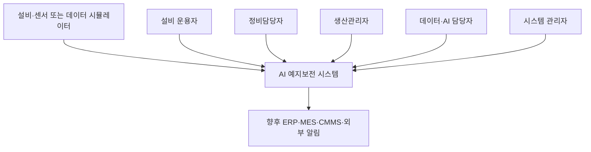
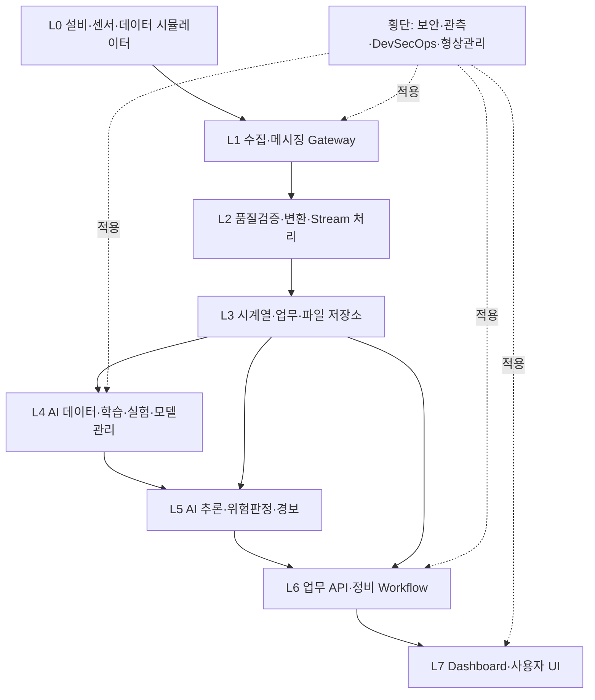
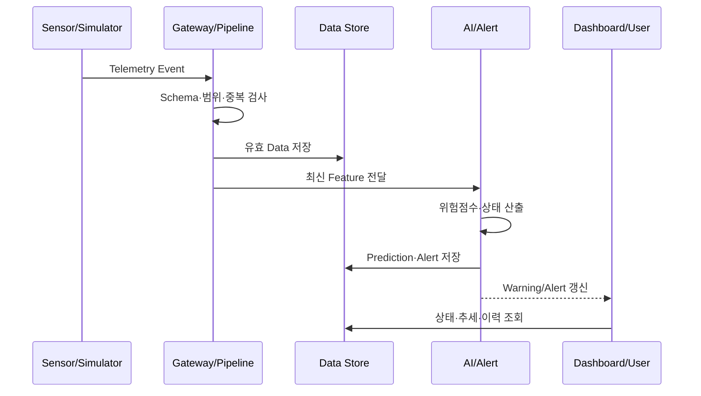
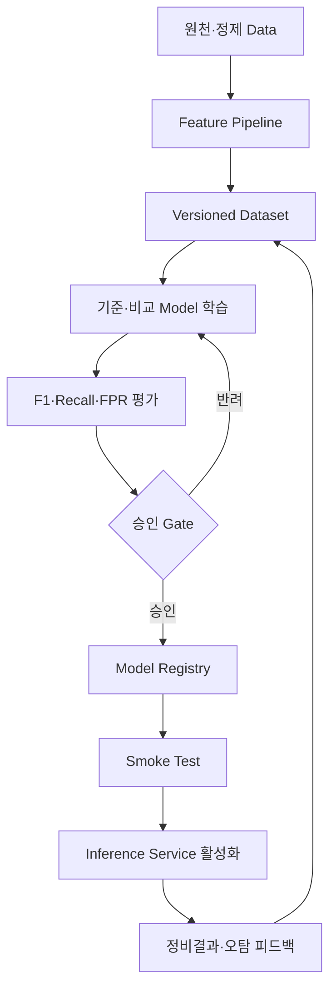
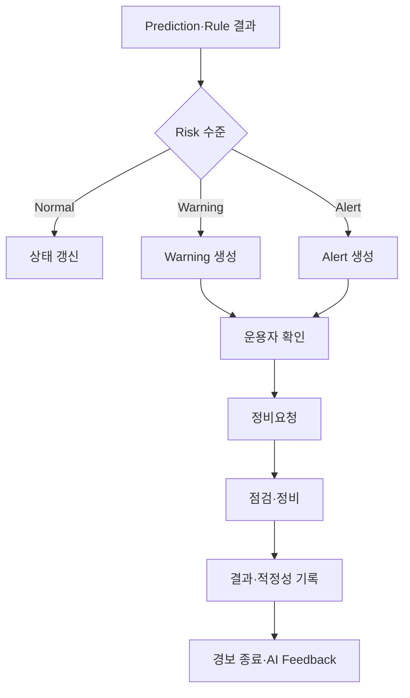
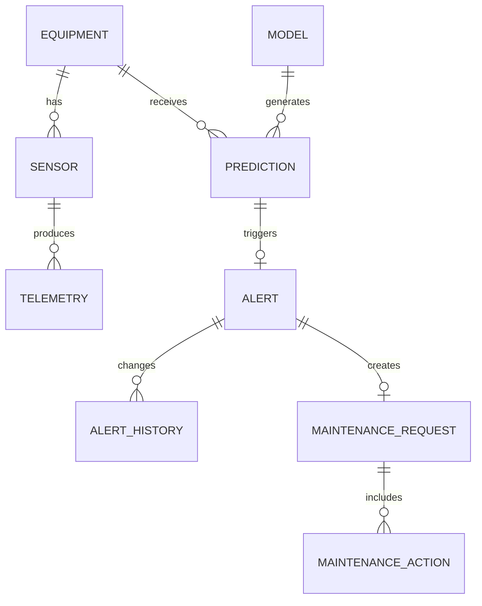
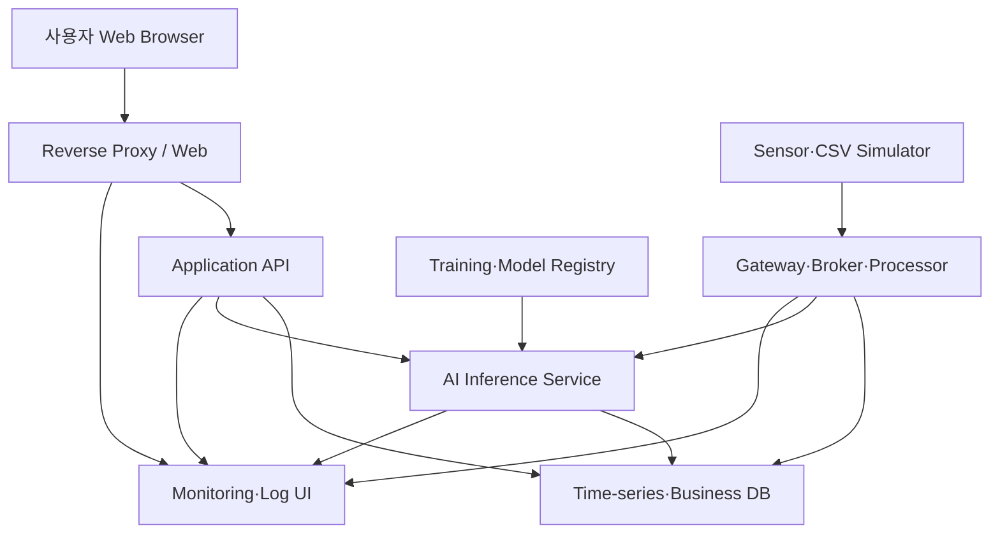

# 설비 상태 모니터링 및 AI 기반 예지보전 시스템 아키텍처 설계서

## 문서관리 정보

| 항목 | 내용 |
|---|---|
| 프로젝트명 | 설비 상태 모니터링 및 AI 기반 예지보전 시스템 |
| 문서명 | 시스템 아키텍처 설계서 및 계층별 OSS 후보군 |
| 관련 Issue | Issue #5 — 시스템 아키텍처 설계 및 계층별 OSS 후보군 정의 |
| 입력 문서 | Issue #2 프로젝트 정의서, Issue #3 User Class 및 운용개념서, Issue #4 통합 요구사항 명세서 |
| 문서 경로 | `docs/05-system-architecture/system-architecture.md` |
| 작업 Branch | `docs/5-system-architecture` |
| PR 대상 Branch | `develop` |
| 문서 버전 | v0.1 |
| 문서 상태 | 아키텍처 기준선 후보 / OSS Long List |
| 개발방식 | Scrum 기반 Agile 개발 |
| 작성일 | 2026-08-14 |
| 작성자 | 프로젝트 수행팀 |
| 검토자 | Product Owner / 아키텍처 검토자 / 교수자 |

> 본 문서는 제품 독립적인 시스템 구조와 계층별 OSS 후보군을 정의한다. 본 문서의 OSS 목록은 최종 선정 결과가 아니며, Issue #6과 #7에서 공식 Repository 검색, 라이선스, 보안, 기능, 성능, 유지관리 및 PoC 결과를 근거로 평가·선정한다.

---

## 1. 문서 목적

본 문서는 Issue #4에서 정의한 155개 요구사항을 구현 가능한 구성요소, 인터페이스, 데이터 흐름과 배치구조로 할당하는 것을 목적으로 한다.

구체적인 목적은 다음과 같다.

1. 시스템 경계와 외부 Actor를 정의한다.
2. 논리·물리·배치 아키텍처를 정의한다.
3. 센서데이터 수집부터 AI 예측, Warning/Alert 및 정비대응까지의 End-to-End 흐름을 정의한다.
4. AI 학습영역과 운영 추론영역을 분리하여 모델의 재현성·승인·배포·Rollback 구조를 정의한다.
5. 기능·AI·비기능 요구사항을 아키텍처 구성요소에 할당한다.
6. 계층별로 필요한 OSS 유형과 Long List 후보를 정의한다.
7. 후속 OSS 검색·평가·PoC와 상세설계의 기준을 제공한다.

---

## 2. 아키텍처 범위

### 2.1 포함범위

- 센서 또는 데이터 시뮬레이터
- Telemetry 수집과 품질검증
- 메시지 전달과 데이터 처리
- 시계열·업무·모델 메타데이터 저장
- 설비상태 모니터링 대시보드
- AI 데이터 준비, 학습, 평가와 모델관리
- 실시간 또는 준실시간 AI 추론
- Warning·Alert 판단과 경보 생명주기
- 정비요청·조치·피드백 관리
- 인증·인가, 감사로그, Secret 관리
- 성능·상태·로그 관측
- 컨테이너 기반 개발·시험·배포
- OSS 라이선스·보안·SBOM 관리

### 2.2 제외범위

- AI 판단에 의한 실제 설비 자동 정지
- PLC·Safety Controller의 대체
- 상용공장 수준의 이중화 Cluster
- 다중공장·수천 대 설비 규모 확장
- 완전 자동화된 재학습과 무중단 모델배포
- 실제 ERP·MES·CMMS의 완전한 연동

---

## 3. 주요 아키텍처 동인

| 동인 ID | 아키텍처 동인 | 관련 요구사항 | 설계영향 |
|---|---|---|---|
| DRV-01 | 초당 100건 이상의 센서데이터 처리 | NFR-PERF-001~002 | 비동기 수집, Batch 저장, Backpressure 고려 |
| DRV-02 | 화면표시 p95 5초, 경보표시 p95 3초 | NFR-PERF-003~005 | 경량 데이터 경로, 추론서비스 분리, 지연시간 계측 |
| DRV-03 | AI 모델 직접 개발·평가·적용 | AIR-001~023 | 학습·추론 분리, 실험·모델 버전관리, 승인 Gate |
| DRV-04 | Data Missing 30초 이내 식별 | FUN-015, SCN-04 | Sensor Heartbeat와 마지막 수신시각 감시 |
| DRV-05 | Warning→Alert→정비 폐루프 | FUN-027~040 | 경보 State Machine과 업무 DB 필요 |
| DRV-06 | 24시간 연속운전, RTO 15분 | NFR-REL-001~007 | Health Check, 영속 Volume, 재시작·복구 절차 |
| DRV-07 | 역할기반 접근통제와 감사 | NFR-SEC-001~010 | 중앙 인증·인가, API Guard, Audit Log |
| DRV-08 | Windows와 Ubuntu 이식 | NFR-PORT-001~004 | 표준 컨테이너와 외부화된 구성 |
| DRV-09 | 계층별 OSS 교체 가능성 | NFR-OSS-001~006 | 표준 Protocol·API, Adapter, 느슨한 결합 |
| DRV-10 | 10주·4 Core·RAM 8GB 교육환경 | 프로젝트 제약 | Microservices 최소화, 단일 Node 배포, 단계적 확장 |

---

## 4. 아키텍처 설계원칙

1. **기술 중립성**: 요구사항 단계에서 특정 OSS의 내부 구조에 종속되지 않는다.
2. **관심사 분리**: 수집, 저장, AI, 경보, UI와 운영관리 책임을 분리한다.
3. **표준 인터페이스**: REST/JSON, MQTT, SQL, OpenAPI와 표준 Model Format을 우선한다.
4. **느슨한 결합**: 계층 사이에 Adapter와 명시적 Schema를 두어 OSS를 교체할 수 있도록 한다.
5. **AI 학습·추론 분리**: 고부하 학습이 운영 수집·대시보드에 영향을 주지 않도록 한다.
6. **Human-in-the-loop**: AI는 경보와 근거를 제공하고 실제 정지·정비 판단은 사람이 수행한다.
7. **Security by Design**: 인증, 권한, Secret, 감사와 취약점 점검을 횡단 관심사로 적용한다.
8. **Observability by Design**: 로그, Metric, Trace와 Health 정보를 모든 서비스에 적용한다.
9. **Fail visibly**: 데이터나 AI가 사용할 수 없을 때 Normal로 표시하지 않고 Degraded 상태를 표시한다.
10. **MVP 우선**: 단일 Node에서 검증한 뒤 필요할 때 분산구조로 확장한다.

---

## 5. 시스템 Context 아키텍처



### 외부 Actor와 인터페이스

| 외부 Actor | 입력 | 출력 | 인터페이스 |
|---|---|---|---|
| 센서·시뮬레이터 | 설비 ID, 센서 ID, 시각, 값, 단위 | 수신결과·오류 | REST/JSON, CSV Replay, 선택적 MQTT |
| 설비 운용자 | 경보 확인, 정비요청 | 상태·추세·Warning·Alert | Web UI / REST API |
| 정비담당자 | 점검·조치·경보 적정성 | 경보근거·추세·정비이력 | Web UI / REST API |
| 생산관리자 | 우선순위·조회조건 | 위험설비·미조치 경보·정비현황 | Web UI / Report |
| AI 담당자 | Dataset·학습설정·배포요청 | 모델성능·오류사례·배포상태 | Notebook/CLI/Web/API |
| 시스템 관리자 | 사용자·센서·임계값·구성 | Health·Metric·Log·Audit | Admin UI / API |
| 외부 업무체계 | 향후 정비결과 | 정비요청·Alert | Versioned REST API |

---

## 6. 권장 아키텍처 Style

### 6.1 선택: 모듈형 서비스 아키텍처

교육용 MVP에는 다음과 같은 **모듈형 Backend + 분리된 AI 추론서비스 + OSS Infrastructure** 구조를 권장한다.

```text
Web UI
   ↓
API / Business Backend
   ├── Equipment Module
   ├── Telemetry Module
   ├── Alert Module
   ├── Maintenance Module
   └── Administration Module
   ↓                   ↓
Database          AI Inference Service
   ↑                   ↑
Telemetry Pipeline   Approved Model
```

### 6.2 선택근거

| 고려항목 | 적용 판단 |
|---|---|
| 개발기간 | 10주이므로 다수 Microservice보다 모듈형 Backend가 유리 |
| 팀 규모 | 4~5명 수준에서 서비스별 Repository·배포 부담을 최소화 |
| AI 독립성 | Python AI 환경과 업무 Backend의 배포·의존성을 분리 |
| OSS 실습 | Broker, Pipeline, DB, Dashboard 등 계층별 교체·비교 가능 |
| 장애격리 | AI 추론 중단 시에도 센서수집·저장·조회는 지속 가능 |
| 확장성 | 향후 Alert, Inference, Ingestion을 별도 Service로 분리 가능 |

### 6.3 적용하지 않는 구조

- 모든 기능을 하나의 실행파일에 결합하는 강한 Monolith
- 10개 이상의 세분화된 Microservices
- MVP 단계의 Kubernetes Cluster 필수화
- 하나의 통합 IoT Platform 내부기능에 모든 업무규칙을 종속시키는 구조

통합 IoT Platform은 별도의 아키텍처 대안으로 PoC하며, 최종 선정 시에도 AI·정비업무와 표준 API로 연결한다.

---

## 7. 논리 계층 아키텍처



### 계층별 책임

| 계층 | 주요 책임 | 입력 | 출력 |
|---|---|---|---|
| L0 설비·시뮬레이터 | 센서값 생성·재생 | 공개 Dataset, 모의규칙 | Telemetry Event |
| L1 수집·메시징 | 연결, 인증, Buffer, 전달 | REST/MQTT/CSV | 원시 Event Stream |
| L2 처리·품질 | Schema, 단위, 범위, 중복, 변환 | 원시 Event | 유효 Event·품질오류 |
| L3 저장 | 시계열·업무·모델 Artifact 영속화 | 유효 Event, 업무 Data | Query·Dataset·이력 |
| L4 AI 개발 | 전처리, 특징, 학습, 평가, Registry | Dataset | 승인 후보 Model |
| L5 추론·경보 | 위험점수, 상태판정, Warning/Alert | 최신 특징, 승인 Model | Prediction·Alert Event |
| L6 업무 API | 설비·사용자·경보·정비 Workflow | UI/API 요청 | 업무결과·상태변경 |
| L7 UI | 대시보드, 경보, 정비, 관리화면 | API·Query | 사용자 정보·입력 |
| L8 횡단영역 | IAM, Secret, Log, Metric, CI/CD, SBOM | 전 구성요소 | 통제·증적·운영정보 |

---

## 8. 논리 구성요소 설계

| 구성요소 ID | 구성요소 | 주요 책임 | 영속 Data | 주요 요구사항 |
|---|---|---|---|---|
| CMP-01 | Data Simulator | CSV·규칙 기반 센서 Event 재생 | Replay 설정 | INT-011, DAT-001~004 |
| CMP-02 | Telemetry Gateway | REST/MQTT 수신, 인증, Rate 제한 | 연결상태 | FUN-011, INT-008~012 |
| CMP-03 | Message Broker | 비동기 전달, 일시 Buffer, Producer·Consumer 분리 | Queue/Topic | NFR-PERF-001~003 |
| CMP-04 | Data Quality Processor | Schema·범위·중복·결측 검사, 단위 표준화 | 오류·격리 Data | FUN-012~016, DAT-003~006 |
| CMP-05 | Telemetry Repository | 시계열 저장, 기간 Query, 집계 | Sensor Time Series | FUN-017~022, DAT-007 |
| CMP-06 | Business Repository | 사용자·설비·경보·정비·Audit | Relational Data | FUN-001~010, 027~045 |
| CMP-07 | Feature Pipeline | Window·통계특징 생성, Dataset 구성 | Feature Dataset | AIR-001~007 |
| CMP-08 | Model Training | 기준·비교모델 학습과 평가 | Experiment Result | AIR-008~015 |
| CMP-09 | Model Registry | Model·Dataset·Code·승인상태 관리 | Model Metadata·Artifact | AIR-016~017 |
| CMP-10 | Inference Service | 승인모델 Loading, Schema 검증, 위험점수 산출 | Prediction | FUN-023~026, AIR-018~021 |
| CMP-11 | Risk & Alert Engine | 임계값·규칙, 중복억제, 경보 생성 | Alert·Threshold | FUN-027~034, 041~042 |
| CMP-12 | Maintenance Service | 요청·점검·조치·피드백 Workflow | Maintenance Record | FUN-035~040 |
| CMP-13 | Application API | Versioned API, 권한, Validation, Orchestration | Request Metadata | INT-001~019 |
| CMP-14 | Web Dashboard | 상태·추세·Alert·정비·관리 UI | 사용자 설정 | NFR-USE-001~006 |
| CMP-15 | IAM Service | 인증·역할·Token·Session | User·Role | NFR-SEC-001~005 |
| CMP-16 | Observability | Log·Metric·Trace·Health·Alert | 운영 Telemetry | NFR-OBS-001~004 |
| CMP-17 | DevSecOps Pipeline | Build·Test·Scan·SBOM·Image·Release | Build Artifact | NFR-MNT, PORT, OSS, SEC |

---

## 9. 센서데이터 및 AI 추론 흐름



### 처리단계와 목표시간

| 단계 | 목표 | 관련 NFR |
|---|---:|---|
| Gateway 수신·검증 | p95 0.5초 이하 | NFR-PERF-001~002 |
| Broker·Processor 전달 | p95 0.5초 이하 | NFR-PERF-003 |
| 저장과 최신값 갱신 | p95 1초 이하 | NFR-PERF-003 |
| AI 단일 추론 | p95 1초 이하 | NFR-PERF-004 |
| Alert 생성·UI 반영 | p95 3초 이하 | NFR-PERF-005 |
| 전체 수집→Dashboard | p95 5초 이하 | NFR-PERF-003 |

---

## 10. AI 학습·모델관리 흐름



### AI 영역 분리원칙

| 영역 | 실행시점 | 자원특성 | 운영영향 |
|---|---|---|---|
| Offline Training | Sprint 또는 재학습 시 | CPU·Memory 사용량 큼 | 운영 Path와 분리 |
| Model Registry | 모델 생성·승인 시 | Metadata·Artifact 저장 | 승인되지 않은 모델 차단 |
| Online Inference | Telemetry 수신 시 | 낮은 지연, 높은 가용성 | 수집·경보 Path에 포함 |
| Feedback Analysis | 정비완료·Review 시 | Batch 분석 | 후속 Dataset 개선 |

### 모델 배포상태

```text
Candidate → Evaluated → Approved → Staged → Active → Retired
                                ↘ Failed → Rollback
```

### 모델 Artifact 필수 Metadata

- Model ID와 Semantic Version
- Dataset ID와 Version
- Git Commit SHA
- 전처리·특징 Schema Version
- 알고리즘과 Hyperparameter
- Accuracy, Precision, Recall, F1, FPR
- 학습·평가 실행시각과 실행환경
- 승인자, 승인일, 배포일
- 직전 활성모델과 Rollback 위치

---

## 11. 경보 및 정비 Workflow 아키텍처



### 경보 State Machine 구현규칙

| 현재상태 | 허용 다음상태 | 주체 |
|---|---|---|
| New | Acknowledged | 운용자·정비담당자 |
| Acknowledged | Requested | 운용자·정비담당자·생산관리자 |
| Requested | In Progress | 정비담당자 |
| In Progress | Resolved | 정비담당자 |
| Resolved | Closed 또는 In Progress | 정비담당자·관리자 |
| Closed | 변경불가, 새 경보 생성 | 시스템 |

- State 변경은 Transaction으로 처리한다.
- 상태변경마다 사용자, 시각, 이전·다음상태와 의견을 Audit에 기록한다.
- 동일 설비·원인의 5분 이내 경보는 Correlation Key로 그룹화한다.
- AI가 사용할 수 없을 때 Rule 경보와 Data Missing 경보는 독립 동작한다.

---

## 12. 데이터 아키텍처

### 12.1 Data Store 분리

| Store | 주요 Data | 특성 | 보존기간 |
|---|---|---|---:|
| Time-series Store | 원시·정제 Sensor 값, Latest 상태 | 시간범위 Query, 집계, 높은 Write | 90일 이상 |
| Relational Store | 사용자, 설비, 센서, 경보, 정비, Threshold | Transaction, 관계, 상태무결성 | 180일 이상 |
| Object/File Store | CSV, Dataset, Model, Report, SBOM | Versioned Artifact | Project 기간 이상 |
| Log/Metric Store | Application Log, Metric, Trace | 검색·집계·운영분석 | 30~180일 정책 |

MVP에서는 PostgreSQL 계열 하나로 시계열과 업무 Data를 함께 관리할 수 있으나, 논리 Schema와 Repository Interface는 분리한다.

### 12.2 핵심 Entity



### 12.3 Data Partition·Index 원칙

- Telemetry는 측정시각을 기준으로 저장·검색한다.
- 기본 Query Key는 `equipment_id + sensor_id + timestamp`이다.
- `equipment_id`, `sensor_id`, `timestamp`, `alert_status`에 Index를 적용한다.
- 고유키 `(equipment_id, sensor_id, timestamp)`로 중복을 방지한다.
- 장기 Query에서는 원시값과 집계값을 구분한다.
- 결측은 숫자 0이 아닌 `null` 또는 Quality 상태로 저장한다.

---

## 13. API 및 Interface 아키텍처

### 13.1 외부 API

| API | 용도 | 호출자 | 주요 구성요소 |
|---|---|---|---|
| `POST /api/v1/telemetry` | Telemetry 입력 | Simulator·Gateway | CMP-02, 04 |
| `POST /api/v1/predictions` | AI 추론 | Pipeline·Backend | CMP-10 |
| `GET /api/v1/equipment/{id}/status` | 설비상태 조회 | Web UI | CMP-13 |
| `GET /api/v1/alerts` | 경보 검색 | Web UI | CMP-11, 13 |
| `PATCH /api/v1/alerts/{id}` | 경보 상태변경 | Web UI | CMP-11, 13 |
| `POST /api/v1/maintenance-requests` | 정비요청 | Web UI | CMP-12, 13 |
| `GET /health` | Process 생존확인 | Monitoring | 모든 Service |
| `GET /ready` | Dependency 준비확인 | Monitoring | 모든 Service |

### 13.2 Interface 원칙

- 외부 HTTP API는 `/api/v1`로 Versioning한다.
- Schema는 OpenAPI 3.0 이상으로 정의한다.
- Event Schema와 API Schema에는 별도 Version을 부여한다.
- 모든 요청은 `request_id` 또는 `correlation_id`를 전달한다.
- HTTP 오류는 `error_code`, `message`, `timestamp`, `request_id`를 제공한다.
- AI Service 내부장애는 Business API가 HTTP 5xx를 그대로 노출하지 않고 Degraded 상태로 변환한다.
- Broker 선택 여부와 관계없이 Domain Event 이름과 Payload는 독립적으로 정의한다.

### 13.3 Domain Event

| Event | Producer | Consumer | 필수정보 |
|---|---|---|---|
| `telemetry.received.v1` | Gateway | Quality Processor | 설비·센서·시각·값·단위 |
| `telemetry.validated.v1` | Quality Processor | Store·Inference | 정제값·Quality·Schema Version |
| `prediction.created.v1` | Inference | Alert Engine·Store | Model Version·Score·Status |
| `alert.created.v1` | Alert Engine | UI·Workflow | Alert ID·Level·Evidence |
| `alert.status.changed.v1` | Workflow | Audit·UI | 이전·다음상태·사용자 |
| `maintenance.completed.v1` | Maintenance | Alert·AI Feedback | 조치·실제 이상·적정성 |

---

## 14. 물리·배치 아키텍처

### 14.1 MVP 단일 Node 배치



### 14.2 Container 구성

| Container Group | 주요 Process | 최소 자원권고 |
|---|---|---:|
| `edge-simulator` | CSV Replay·Sensor Generator | CPU 0.25, RAM 256MB |
| `ingestion` | Broker·Collector·Quality Processor | CPU 1.0, RAM 1GB |
| `database` | Time-series·Business DB | CPU 1.0, RAM 2GB |
| `backend` | API·Alert·Maintenance | CPU 1.0, RAM 1GB |
| `ai-inference` | Model Loading·Prediction | CPU 1.0, RAM 1.5GB |
| `dashboard` | Web·Visualization | CPU 0.5, RAM 512MB |
| `observability` | Metric·Log·Health | CPU 0.5, RAM 1GB |

모든 Container를 동시에 실행할 때 RAM 8GB 기준을 넘지 않도록 후보 OSS PoC에서 실제 사용량을 측정한다. NiFi, ThingsBoard, Kafka 등 상대적으로 무거운 후보는 별도 Profile로 시험한다.

### 14.3 향후 Edge·Server 분리

```text
Edge Node
 ├── Sensor Adapter
 ├── Local Broker/Buffer
 └── Data Quality
          ↓ TLS/MQTT/HTTPS
Central Server
 ├── Data Store
 ├── AI Inference
 ├── Alert/Maintenance API
 ├── Dashboard
 └── Model/Operations
```

---

## 15. 보안 아키텍처

### 15.1 Trust Zone

| Zone | 구성요소 | 주요 통제 |
|---|---|---|
| Z1 Device Zone | Sensor·Simulator·Edge Adapter | Device ID, 입력 Schema, Rate Limit |
| Z2 Service Zone | Gateway·Backend·AI | Service 인증, 최소권한, Network 분리 |
| Z3 Data Zone | DB·Model·Backup | 계정분리, 암호화, Volume 권한, Backup |
| Z4 User Zone | Browser·Admin | 로그인, RBAC, Session Timeout |
| Z5 Management Zone | CI/CD·Monitoring·Registry | 관리자 권한, Audit, Secret 보호 |

### 15.2 보안 통제 배치

- Reverse Proxy 또는 API 계층에서 TLS와 요청크기·Rate를 제한한다.
- IAM은 사용자 인증과 Role Claim을 발급한다.
- Backend는 Endpoint와 업무 Operation 모두에서 권한을 재검증한다.
- AI Service는 외부에 직접 공개하지 않고 내부 Network에서만 접근한다.
- DB Account는 서비스별로 분리하고 필요한 Schema 권한만 부여한다.
- 비밀번호·Token·API Key는 환경변수 또는 Secret Store로 주입한다.
- Git Repository와 Container Image에 평문 Secret을 포함하지 않는다.
- 로그인·권한·임계값·모델배포·경보종료는 Audit Store에 기록한다.
- Dependency와 Container Image는 Release마다 취약점 Scan한다.
- Critical·High 미조치 취약점이 있으면 Release Gate를 통과하지 못한다.

---

## 16. 성능·신뢰성 아키텍처

### 16.1 성능전략

| 요구 | 설계전략 |
|---|---|
| 100 Message/s | Broker Buffer, Batch Insert, 비동기 Consumer |
| Dashboard p95 5초 | Latest State Cache 또는 최신값 Table, Push/Poll 최적화 |
| Query p95 2초 | 시간·설비 Index, 기간제한, Downsampling |
| Inference p95 1초 | Model Preload, Batch 1 최적화, 별도 Process |
| 경보 p95 3초 | Inference 직후 Event 기반 Alert Engine 실행 |
| RAM 8GB | 경량 Profile, Container Limit, 무거운 후보 선택적 실행 |

### 16.2 장애격리와 대체운용

| 장애 | 시스템 반응 | 유지 기능 |
|---|---|---|
| Sensor 단절 | 30초 이내 Data Missing | 다른 Sensor·설비 감시 |
| Broker 일시중단 | Producer Retry·Local Buffer | 기존 Data 조회 |
| DB 일시중단 | Consumer Retry·Queue 보존 | 제한적 수집 Buffer |
| AI 추론 중단 | Prediction Unavailable·Degraded | 수집·저장·Rule 경보 |
| Dashboard 중단 | API와 수집 지속 | Data 영속화 |
| 새 Model 오류 | 직전 승인 Model로 5분 이내 Rollback | 기존 Model 추론 |

### 16.3 복구전략

- 영속 Data는 Named Volume 또는 Host Volume을 사용한다.
- DB는 1일 1회 Backup, 최근 7개 보존을 목표로 한다.
- 구성파일과 Infrastructure as Code는 Git에서 Version 관리한다.
- `compose up` 기반 재기동과 Restore 절차를 문서화한다.
- RTO 15분·RPO 24시간을 복구시험으로 확인한다.

---

## 17. 관측성 아키텍처

### 관측 Data

| 종류 | 필수항목 | 활용 |
|---|---|---|
| Log | Timestamp, Level, Service, Message, Request ID | 오류분석·감사 |
| Metric | 수신·오류·추론·경보건수, Queue, p95 지연 | 성능·상태 판단 |
| Trace | Gateway→Processor→AI→Alert Correlation | End-to-End 지연분석 |
| Health | Liveness, Readiness, Dependency | 재시작·운영판단 |
| Audit | User, Action, Before/After, Time | 책임·변경 추적 |

### 핵심 Metric

- `telemetry_received_total`
- `telemetry_rejected_total`
- `telemetry_processing_latency_seconds`
- `inference_requests_total`
- `inference_latency_seconds`
- `alerts_created_total{level}`
- `alerts_unacknowledged_total`
- `service_health_status`
- `model_active_version`

---

## 18. 계층별 OSS 후보군(Long List)

### 18.1 후보 작성원칙

- 아래 라이선스는 2026-08-14 공식 Website 또는 공식 GitHub Repository의 초기 확인결과이다.
- 최종 적용 Version의 `LICENSE`, `NOTICE`, Dependency와 Edition을 Issue #6에서 다시 확인한다.
- `무료 사용 가능`과 `OSI 승인 Open Source`를 동일하게 판단하지 않는다.
- Plugin·Container Image·Model·Dataset은 본체 OSS와 별도 라이선스일 수 있다.
- 후보군에 포함되었다는 사실은 선정 또는 사용승인을 의미하지 않는다.

### L0 데이터 시뮬레이터·Edge Adapter

| 후보 | 역할·특징 | 초기 License | 아키텍처 적합성 | 주요 확인사항 |
|---|---|---|---|---|
| Python 자체 Simulator | CSV Replay·이상 Pattern 생성 | 프로젝트 License | 매우 높음 | 학생 직접 구현범위 |
| Eclipse Paho | MQTT Client | EPL-2.0 / EDL 계열 | 높음 | 언어별 Client License |
| Node-RED | Flow 기반 Adapter·Simulator | Apache-2.0 | 높음 | 추가 Node별 License·RAM |
| Telegraf | Plugin 기반 수집·처리 Agent | MIT | 높음 | Sensor Protocol Plugin |

### L1 메시지 Broker·수집 Gateway

| 후보 | 역할·특징 | 초기 License | 적합성 | 주요 확인사항 |
|---|---|---|---|---|
| Eclipse Mosquitto | 경량 MQTT 5.0/3.1.1 Broker | EPL-2.0 OR BSD-3-Clause | 매우 높음 | 인증·영속성·Cluster 제약 |
| RabbitMQ | 범용 Message Broker, MQTT Plugin | MPL-2.0 | 중간 | Resource와 Plugin 설정 |
| Apache Kafka | 대규모 Event Streaming | Apache-2.0 | 낮음~중간 | MVP 8GB 환경에는 과대 가능 |
| FastAPI Gateway | REST Telemetry 수신 직접 구현 | MIT | 매우 높음 | Queue·Backpressure 직접 설계 |

### L2 통합·품질검증·Stream 처리

| 후보 | 역할·특징 | 초기 License | 적합성 | 주요 확인사항 |
|---|---|---|---|---|
| Node-RED | Low-code Event Flow와 변환 | Apache-2.0 | 높음 | Flow Test와 Plugin License |
| Telegraf | 수집·Processor·Aggregator Plugin | MIT | 높음 | 업무규칙 구현한계 |
| Apache NiFi | 시각적 Dataflow·Provenance | Apache-2.0 | 중간 | RAM·운영복잡도 |
| Python Custom Processor | Pandera/Pydantic 기반 검증 | 개별 License | 매우 높음 | 직접 코드·시험 필요 |

### L3 시계열·업무 Data Store

| 후보 | 역할·특징 | 초기 License | 적합성 | 주요 확인사항 |
|---|---|---|---|---|
| PostgreSQL | 업무·시계열 통합 가능 RDBMS | PostgreSQL License | 매우 높음 | Partition·Index·성능 PoC |
| QuestDB | 시계열 중심 SQL Database | Apache-2.0 OSS Edition | 높음 | Transaction 업무 Data 분리 필요 |
| TimescaleDB | PostgreSQL 기반 시계열 확장 | Apache-2.0 영역 + TSL 기능 | 조건부 | Edition·기능별 License 분리 |
| InfluxDB | 시계열 저장·Query | Version·Edition별 확인 필요 | 조건부 | License 변화와 API Version |
| SQLite | 소규모 업무·교육용 단일 File DB | Public Domain | 중간 | 동시 Write·확장성 제한 |

### L4 AI 개발·실험·모델관리

| 후보 | 역할·특징 | 초기 License | 적합성 | 주요 확인사항 |
|---|---|---|---|---|
| scikit-learn | 기준모델·전처리·평가 | BSD-3-Clause | 매우 높음 | 시계열 Feature Pipeline |
| XGBoost | Gradient Boosting 비교모델 | Apache-2.0 | 매우 높음 | 불균형·Hyperparameter |
| PyTorch | Deep Learning·시계열 모델 | BSD-style | 중간~높음 | 데이터량·학습시간 |
| TensorFlow/Keras | Deep Learning·Serving 연계 | Apache-2.0 | 중간 | Image 크기·자원사용량 |
| MLflow | Experiment Tracking·Model Registry | Apache-2.0 | 높음 | 인증·Artifact Store 구성 |
| DVC | Dataset·Pipeline Version 관리 | Apache-2.0 | 중간~높음 | Git와 대용량 Data 연계 |

### L5 AI 추론·위험판정

| 후보 | 역할·특징 | 초기 License | 적합성 | 주요 확인사항 |
|---|---|---|---|---|
| FastAPI + Model Library | 경량 Python 추론 API | MIT + Model별 | 매우 높음 | Schema·동시성·Model Preload |
| ONNX Runtime | Framework 중립 추론 Runtime | MIT | 높음 | Model 변환 정확도 |
| MLflow Model Serving | Registry 연계 Serving | Apache-2.0 | 높음 | 자원·인증·운영 복잡도 |
| BentoML | Model API·Packaging | Apache-2.0 | 중간~높음 | 교육범위·Image 크기 |
| 자체 Risk Engine | Threshold·Rule·중복억제 | 프로젝트 License | 매우 높음 | Unit Test·Audit 필수 |

### L6 업무 API·Workflow

| 후보 | 역할·특징 | 초기 License | 적합성 | 주요 확인사항 |
|---|---|---|---|---|
| FastAPI | OpenAPI 기반 Python API | MIT | 매우 높음 | Auth·Migration·Background Task |
| Flask | 경량 Python Web Framework | BSD-3-Clause | 높음 | Schema·OpenAPI 추가구성 |
| Django + DRF | IAM·Admin·ORM 포함 | BSD 계열 | 중간 | 학습곡선·구성규모 |
| ThingsBoard CE | Device·Rule·Dashboard 통합 Platform | Apache-2.0 | 대안구조 | AI·정비 Workflow 통합방식 |

### L7 Dashboard·사용자 UI

| 후보 | 역할·특징 | 초기 License | 적합성 | 주요 확인사항 |
|---|---|---|---|---|
| Grafana OSS | 시계열 Dashboard·Alert 시각화 | AGPL-3.0 | 높음 | 배포·수정 시 AGPL 의무 |
| ThingsBoard CE | IoT Dashboard·Device 상태 | Apache-2.0 | 높음 | 통합 Platform 종속성 |
| Apache Superset | SQL 기반 분석 Dashboard | Apache-2.0 | 중간 | 실시간 Alert Workflow 한계 |
| React | Custom 업무·경보 UI | MIT | 높음 | 직접 개발량 |
| Server-rendered HTML | 최소 Custom UI | Framework별 | 매우 높음 | 복잡한 시각화 한계 |

### L8 인증·보안

| 후보 | 역할·특징 | 초기 License | 적합성 | 주요 확인사항 |
|---|---|---|---|---|
| Keycloak | IAM·OIDC·Role·Token | Apache-2.0 | 높음 | RAM·초기설정·운영복잡도 |
| Backend 자체 JWT | 경량 MVP 인증 | Library별 | 높음 | 보안구현 책임 증가 |
| Trivy | Dependency·Image·License Scan | Apache-2.0 | 매우 높음 | DB Update·CI Integration |
| OWASP Dependency-Check | 알려진 Dependency 취약점 | Apache-2.0 | 높음 | False Positive 관리 |
| Syft/Grype | SBOM 생성·취약점 Scan | Apache-2.0 | 높음 | Format와 CI Integration |

### L8 관측성·운영

| 후보 | 역할·특징 | 초기 License | 적합성 | 주요 확인사항 |
|---|---|---|---|---|
| Prometheus | Metric 수집·Query | Apache-2.0 | 매우 높음 | 보존기간·Resource |
| Alertmanager | 운영경보 Routing·Grouping | Apache-2.0 | 높음 | 설비업무 Alert와 구분 |
| OpenTelemetry Collector | Log·Metric·Trace 수집표준 | Apache-2.0 | 높음 | 초기구성 복잡도 |
| Grafana Loki | Log 수집·검색 | AGPL-3.0 | 중간~높음 | License·저장구성 |
| Python Structured Logging | 경량 JSON Log | Library별 | 매우 높음 | 중앙검색 기능 별도 |

### L8 배포·DevSecOps

| 후보 | 역할·특징 | 초기 License | 적합성 | 주요 확인사항 |
|---|---|---|---|---|
| Docker Engine/Moby + Compose | Container Build·단일 Node 배포 | 구성요소별 확인 | 매우 높음 | Docker Desktop 사용조건 구분 |
| Podman + Compose | Daemonless Container | Apache-2.0 | 높음 | Windows 사용성·Compose 호환 |
| Kubernetes | Cluster Orchestration | Apache-2.0 | 향후 확장 | MVP에는 과대구성 |
| GitHub Actions | CI/CD Workflow | 서비스 이용조건 | 매우 높음 | Runner·Secret·분 사용량 |

---

## 19. 아키텍처 대안

### 대안 A: 조립형 OSS Stack

```text
Mosquitto/FastAPI
 → Node-RED/Telegraf/Python Processor
 → PostgreSQL/QuestDB
 → scikit-learn·XGBoost·MLflow
 → FastAPI Inference·Alert
 → Grafana + Custom Maintenance UI
```

| 장점 | 단점 |
|---|---|
| 계층별 OSS 평가와 교체 학습에 가장 적합 | 통합·인증·운영을 직접 설계해야 함 |
| 요구사항-구성요소 추적이 명확 | 구성요소 수 증가 |
| AI와 업무 Workflow를 자유롭게 구현 | Dashboard와 업무 UI 이원화 가능 |

### 대안 B: 통합 IoT Platform 중심

```text
ThingsBoard CE
 → Device·Rule·Telemetry·Dashboard
 ↔ Python AI Training/Inference Service
 → PostgreSQL
```

| 장점 | 단점 |
|---|---|
| Device·Rule·Dashboard를 빠르게 구현 | Platform 내부구조와 Data Model 종속 |
| 초기 시연시간 단축 | 계층별 OSS 선정학습 범위 축소 가능 |
| Community Edition의 통합기능 활용 | 정비 Workflow·AI Registry는 별도 필요 |

### 대안 C: 최소 Custom Application

```text
FastAPI + PostgreSQL + scikit-learn/XGBoost + Custom Web UI
```

| 장점 | 단점 |
|---|---|
| 8GB 환경에서 단순하고 이해하기 쉬움 | MQTT·Dashboard·관측 기능 직접 구현 증가 |
| 코드·요구사항 추적이 쉬움 | OSS 활용·비교학습 범위가 작음 |

### 초기 권고

Issue #6 PoC에서는 **대안 A와 대안 B를 우선 비교**한다. 교수자 시범과제의 목표가 계층별 OSS 검색·평가와 통합 이해이므로 조립형 대안 A를 기준 아키텍처로 유지하고, ThingsBoard CE를 통합형 대안으로 비교하는 것이 적합하다. 이는 최종선정이 아니라 평가의 기준가설이다.

---

## 20. Architecture Decision Record 후보

| ADR | 결정주제 | 주요 대안 | 결정기준 | 목표시점 |
|---|---|---|---|---|
| ADR-001 | 조립형 vs 통합 IoT Platform | A/B/C | 교육효과, 통합시간, 자원, License | Issue #7 |
| ADR-002 | Telemetry 수집방식 | REST, MQTT, 병행 | 지연, 신뢰성, 구현난이도 | Issue #6 PoC |
| ADR-003 | Message Broker | Mosquitto, RabbitMQ, Kafka | RAM, MQTT, Buffer, 운영 | Issue #7 |
| ADR-004 | Data Store | PostgreSQL, QuestDB, TimescaleDB | Write, Query, Transaction, License | Issue #7 |
| ADR-005 | Dashboard | Grafana, ThingsBoard, Custom | 실시간성, 업무 UI, License | Issue #7 |
| ADR-006 | AI Framework | scikit-learn, XGBoost, DL | 성능, 설명성, 학습시간 | Issue #8 |
| ADR-007 | Experiment·Registry | File/Git, MLflow, DVC | 재현성, 자원, 복잡도 | Issue #7~8 |
| ADR-008 | IAM | 자체 JWT, Keycloak | 보안, RAM, 교육범위 | Issue #7 |
| ADR-009 | Container Runtime | Docker/Moby, Podman | Windows, License, 사용성 | Issue #7 |
| ADR-010 | 관측 Stack | 경량 Log, Prometheus, OTel | NFR 증적, RAM, 설정 | Issue #7 |

ADR 파일 위치는 다음을 권장한다.

```text
docs/05-system-architecture/adr/
├── ADR-001-platform-strategy.md
├── ADR-002-telemetry-protocol.md
└── ADR-003-data-store.md
```

---

## 21. 요구사항-아키텍처 추적성

| 요구사항 범위 | 주요 아키텍처 구성요소 |
|---|---|
| FUN-001~005 사용자·권한 | CMP-13 Application API, CMP-15 IAM |
| FUN-006~010 설비·센서 | CMP-06 Business Repository, CMP-13 API, CMP-14 UI |
| FUN-011~016 수집·품질 | CMP-01~05 |
| FUN-017~022 Dashboard | CMP-05, 06, 13, 14 |
| FUN-023~026 AI 결과 | CMP-07~10, CMP-13~14 |
| FUN-027~034 Warning·Alert | CMP-10~11, CMP-13~14 |
| FUN-035~040 정비 | CMP-06, CMP-12~14 |
| FUN-041~045 관리·로그 | CMP-06, CMP-13~17 |
| AIR-001~007 Data·재현성 | CMP-05, CMP-07, CMP-09 |
| AIR-008~015 학습·평가 | CMP-07~09 |
| AIR-016~023 배포·운영 | CMP-09~10, CMP-17 |
| DAT-001~015 | CMP-04~06, CMP-09~12 |
| INT-001~019 | CMP-02, CMP-10, CMP-13, CMP-16 |
| NFR-PERF | CMP-02~05, CMP-10~14, Broker·DB 후보 |
| NFR-REL | CMP-03, CMP-05~06, CMP-10, CMP-16~17 |
| NFR-SEC | CMP-13, CMP-15, CMP-17 |
| NFR-USE | CMP-14 |
| NFR-MNT | 모든 Custom Component, CMP-17 |
| NFR-PORT | Container·Compose, CMP-17 |
| NFR-OSS | OSS Inventory·Scan·SBOM, CMP-17 |
| NFR-OBS | CMP-16 및 모든 Service Instrumentation |

---

## 22. 아키텍처 위험과 대응

| 위험 ID | 위험 | 영향 | 대응 |
|---|---|---|---|
| ARC-R01 | 후보 OSS가 8GB 환경에서 동시에 실행되지 않음 | 통합실패·성능저하 | 경량 Profile, Resource 측정, 무거운 후보 별도 PoC |
| ARC-R02 | 통합 Platform이 AI·정비 Workflow를 제약 | 기능 우회구현 | 표준 API로 AI·업무 Service 분리 |
| ARC-R03 | 시계열 DB Edition별 License 차이 | 사용·배포 제약 | Version·Edition별 LICENSE 확인, 대체후보 유지 |
| ARC-R04 | AI 학습이 운영 Service 자원을 고갈 | 수집·경보 지연 | Offline 학습분리, Container Limit |
| ARC-R05 | Broker·DB 장애 중 Data 유실 | KPI 미달 | Buffer·Retry·중복방지·복구시험 |
| ARC-R06 | AI 오탐·미탐이 잘못된 조치 유발 | 사용자 신뢰저하 | Human-in-the-loop, 근거표시, Rule 병행 |
| ARC-R07 | Grafana 등 Copyleft 의무 미검토 | License Compliance 위험 | 배포·수정방식 분석, NOTICE·소스의무 검토 |
| ARC-R08 | Plugin·Model·Dataset License 누락 | SBOM·배포 위험 | 본체와 별도 License Inventory |
| ARC-R09 | 구성요소 과다로 10주 일정 초과 | MVP 미완료 | Must Path 우선, 선택기능 Profile 분리 |
| ARC-R10 | 인증·감사를 마지막에 적용 | 보안요구 미달 | Sprint 1부터 Identity·Audit Interface 적용 |

---

## 23. Issue #6 OSS PoC 검증항목

### 공통

- [ ] Windows 11·Ubuntu 22.04 이상 설치 가능성
- [ ] Container Image 제공과 Image 크기
- [ ] 4 Core·RAM 8GB 환경의 CPU·RAM 사용량
- [ ] 공식 License, NOTICE, Dependency License
- [ ] Critical·High 취약점
- [ ] 공식 Documentation과 예제
- [ ] 최근 Release와 Issue 대응상태
- [ ] 백업·복구 및 Version Upgrade 절차
- [ ] Vendor Lock-in과 Data Export 가능성

### Telemetry·Broker

- [ ] 초당 100 Message를 10분간 처리
- [ ] 손실률 0.1% 이하
- [ ] 재연결·중복·Buffer 동작
- [ ] MQTT 5.0 또는 REST 지원
- [ ] 인증·TLS 적용성

### Data Store

- [ ] 100 Message/s Write 성능
- [ ] 24시간·3 Sensor Query p95 2초 이하
- [ ] 중복 Key와 Transaction
- [ ] Backup·Restore
- [ ] 90일 보존·Downsampling

### Dashboard

- [ ] Normal·Warning·Alert 표현
- [ ] 최근값·추세·Data Missing 표시
- [ ] 역할별 접근성
- [ ] Custom 업무화면 연계
- [ ] p95 5초 내 갱신

### AI·Model

- [ ] Dataset·Experiment·Model Version 연결
- [ ] scikit-learn·XGBoost Model 저장·Loading
- [ ] 단일 추론 p95 1초 이하
- [ ] 승인·활성·Rollback Workflow
- [ ] F1·Recall·FPR 결과 저장

---

## 24. 권장 Repository 구조

```text
docs/
└── 05-system-architecture/
    ├── system-architecture.md
    ├── diagrams/
    │   ├── context-diagram.md
    │   ├── logical-architecture.md
    │   ├── deployment-architecture.md
    │   └── data-flow.md
    ├── adr/
    │   ├── ADR-001-platform-strategy.md
    │   ├── ADR-002-telemetry-protocol.md
    │   └── ADR-003-data-store.md
    └── traceability/
        └── requirement-component-matrix.md
```

본 Issue에서는 `system-architecture.md` 하나로 제출할 수 있으며, 문서가 커질 경우 위 구조로 분리한다.

---

## 25. 공식 후보자료

- [Eclipse Mosquitto 공식 Website](https://mosquitto.org/)
- [Node-RED 공식 Repository](https://github.com/node-red/node-red)
- [Telegraf 공식 Repository](https://github.com/influxdata/telegraf)
- [Apache NiFi 공식 Website](https://nifi.apache.org/)
- [PostgreSQL 공식 License](https://www.postgresql.org/about/licence/)
- [QuestDB OSS License 안내](https://questdb.com/terms/)
- [Timescale/TigerData License 안내](https://www.tigerdata.com/legal/licenses)
- [Grafana License 안내](https://grafana.com/licensing/)
- [ThingsBoard 공식 Repository](https://github.com/thingsboard/thingsboard)
- [FastAPI 공식 Repository](https://github.com/fastapi/fastapi)
- [scikit-learn 공식 Repository](https://github.com/scikit-learn/scikit-learn)
- [XGBoost 공식 License](https://github.com/dmlc/xgboost/blob/master/LICENSE)
- [MLflow 공식 Website](https://mlflow.org/)
- [Prometheus 공식 Website](https://prometheus.io/)
- [Alertmanager 공식 License](https://github.com/prometheus/alertmanager/blob/main/LICENSE)
- [Keycloak 공식 License](https://github.com/keycloak/keycloak/blob/main/LICENSE.txt)
- [OpenTelemetry Collector 공식 License](https://github.com/open-telemetry/opentelemetry-collector/blob/main/LICENSE)
- [Trivy 공식 License](https://github.com/aquasecurity/trivy/blob/main/LICENSE)
- [Podman 공식 License](https://github.com/containers/podman/blob/main/LICENSE)

---

## 26. 검토 체크리스트

- [ ] Issue #4의 기능·AI·데이터·인터페이스·비기능 요구사항이 구성요소에 할당되었는가?
- [ ] 센서→수집→검증→저장→AI→경보→정비의 전체 흐름이 연결되어 있는가?
- [ ] AI 학습과 운영 추론이 분리되어 있는가?
- [ ] Model·Dataset·Code·배포 Version의 추적구조가 있는가?
- [ ] AI 중단 시에도 수집·저장과 Rule 경보가 유지되는가?
- [ ] Human-in-the-loop와 설비 자동제어 제외원칙이 유지되는가?
- [ ] 경보 State Machine과 정비 Workflow가 정의되어 있는가?
- [ ] 성능·신뢰성·보안·관측성 요구사항이 설계에 반영되어 있는가?
- [ ] RAM 8GB 기준의 자원제약을 고려하였는가?
- [ ] 각 계층별로 2개 이상의 OSS 후보가 정의되어 있는가?
- [ ] 특정 후보가 최종선정된 것으로 오해되지 않도록 표시되어 있는가?
- [ ] License가 Edition·Plugin·Model·Dataset별로 달라질 수 있음을 반영했는가?
- [ ] 후속 PoC와 ADR 결정항목이 정의되어 있는가?

---

## 27. Issue #5 완료기준

다음 조건을 모두 충족하면 Issue #5를 완료한다.

- [ ] `docs/05-system-architecture/system-architecture.md`가 작성되어 있다.
- [ ] 시스템 Context, 논리·물리·배치 아키텍처가 정의되어 있다.
- [ ] 17개 논리 구성요소와 책임·Data·요구사항이 정의되어 있다.
- [ ] 센서데이터·AI 추론·AI 학습·경보·정비 흐름이 정의되어 있다.
- [ ] Data Store, API, Domain Event와 핵심 Entity가 정의되어 있다.
- [ ] 보안 Trust Zone과 역할별 통제가 설계되어 있다.
- [ ] 성능·장애격리·Backup·복구전략이 정의되어 있다.
- [ ] 관측 Log·Metric·Trace·Health 항목이 정의되어 있다.
- [ ] 계층별 OSS Long List와 초기 License가 기록되어 있다.
- [ ] 조립형·통합형·최소 Custom 대안이 비교되어 있다.
- [ ] 10개 ADR 결정후보와 Issue #6 PoC 항목이 정의되어 있다.
- [ ] 155개 요구사항 범위와 구성요소의 추적성이 확인되어 있다.
- [ ] 아키텍처 Review 의견이 반영되어 있다.
- [ ] PR이 승인되어 `develop`에 병합되어 있다.

---

## 28. 검토 및 승인

| 구분 | 성명 | 검토결과 | 일자 | 의견 |
|---|---|---|---|---|
| 아키텍처 작성자 |  |  |  |  |
| 요구사항 담당 |  |  |  |  |
| 데이터·AI 담당 |  |  |  |  |
| OSS·License 담당 |  |  |  |  |
| 보안·운영 담당 |  |  |  |  |
| Scrum Master |  |  |  |  |
| Product Owner/교수자 |  |  |  |  |

### 승인기준

- 모든 Must 요구사항을 구현할 수 있는 구조이어야 한다.
- 10주·4 Core·RAM 8GB 환경에서 단계적으로 구현·시연 가능해야 한다.
- AI 모델을 직접 개발·평가·승인·배포할 수 있어야 한다.
- OSS 구성요소가 표준 Interface로 교체 가능해야 한다.
- Issue #6 검색·평가·PoC를 수행할 충분한 후보와 결정기준이 있어야 한다.

---

## 부록 A. GitHub 작업정보

### Branch 구조

```text
main
└── develop
    └── docs/5-system-architecture
```

### Pull Request 설정

```text
base: develop  ←  compare: docs/5-system-architecture
```

### Commit 메시지 예시

```text
docs: add system architecture and layered OSS candidate groups
```

### Pull Request 제목 예시

```text
[Issue #5] 시스템 아키텍처 및 계층별 OSS 후보군 작성
```

### Pull Request 본문 연결문구

```text
Relates to #5
```

> PR이 `develop`에 병합되고 Product Owner가 아키텍처 기준선을 승인한 후 Issue #5를 Close한다.
