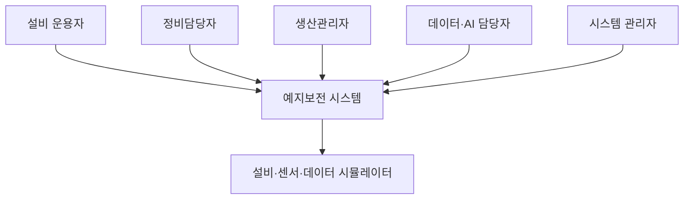
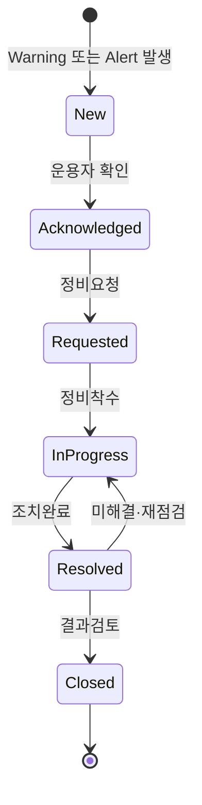
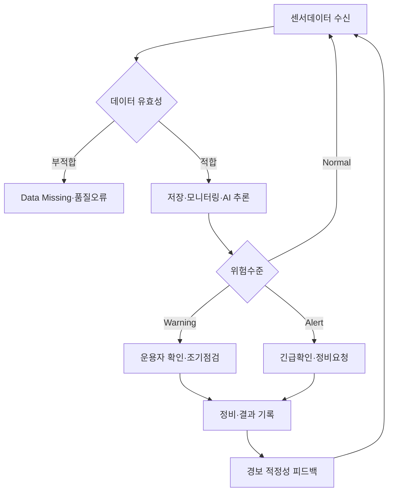

# 설비 상태 모니터링 및 AI 기반 예지보전 시스템 User Class 및 운용개념서

## 문서관리 정보

| 항목 | 내용 |
|---|---|
| 프로젝트명 | 설비 상태 모니터링 및 AI 기반 예지보전 시스템 |
| 문서명 | User Class 및 운용개념서 |
| 관련 Issue | Issue #3 — User Class 식별 및 상세 운용개념·핵심 운용 시나리오 정의 |
| 입력 문서 | Issue #2 프로젝트 정의서 |
| 문서 경로 | `docs/03-conops-user-classes/user-class-conops.md` |
| 작업 Branch | `docs/3-conops-user-classes` |
| PR 대상 Branch | `develop` |
| 문서 버전 | v0.1 |
| 문서 상태 | 초안 / Product Owner 검토 대상 |
| 개발방식 | Scrum 기반 Agile 개발 |
| 작성일 | 2026-08-11 |
| 작성자 | 프로젝트 수행팀 |
| 검토자 | Product Owner / 교수자 |

> 본 문서는 최초 운용개념 기준선이면서 Sprint Review 결과에 따라 갱신되는 Living Document이다. User Class, 업무 흐름 또는 경보 처리정책이 변경되면 관련 GitHub Issue와 변경근거를 남기고 본 문서를 개정한다.

---

## 1. 문서 목적

본 문서는 설비 상태 모니터링 및 AI 기반 예지보전 시스템을 직접 또는 간접적으로 사용하는 사람을 User Class로 구분하고, 각 User Class의 목표, 업무책임, 사용빈도, 숙련도, 필요정보 및 접근권한을 정의한다.

또한 시스템이 실제 운용환경에서 어떻게 사용되는지를 설명하기 위해 다음을 정의한다.

- 시스템 운용환경과 운용원칙
- 시스템 상태와 운용모드
- User Class별 역할과 권한
- 정상 모니터링, Warning, Alert 및 정비대응 절차
- 센서·통신장애와 AI 모델 갱신 절차
- 예외상황과 대체 흐름
- 초기 User Story와 Acceptance Criteria
- Issue #4 상세 요구사항으로 전환할 항목

---

## 2. 적용범위

본 문서의 운용개념은 교육용 MVP를 대상으로 한다. 실제 생산설비를 자동 정지하거나 제어하지 않으며, AI는 운용자와 정비담당자의 판단을 지원하는 역할만 수행한다.

### 포함되는 운용 범위

- 센서데이터 또는 모의데이터 수신
- 데이터 유효성 확인과 저장
- 설비상태 및 데이터 추세 모니터링
- AI 고장징후 위험점수 산출
- Normal, Warning, Alert 상태 표시
- 경보 확인, 정비요청, 조치중, 조치완료 처리
- 센서·통신장애 표시와 복구
- AI 모델 학습·평가·승인·배포·복구
- 사용자, 로그, 설정 및 OSS 구성정보 관리

### 제외되는 운용 범위

- AI 판단에 의한 실제 설비 자동 정지
- 실제 안전제어장치의 대체
- 실제 ERP·MES·CMMS의 완전한 연동
- 외부 SMS·전화·모바일 Push의 실제 전송
- 상용공장 운영자에 대한 법적·안전 인증

---

## 3. 운용개념 요약

목표 시스템은 설비 또는 데이터 시뮬레이터로부터 센서데이터를 수집하고, 데이터 저장소와 대시보드를 통해 현재 상태와 이력을 제공한다. AI 추론서비스는 새로운 센서데이터에서 고장징후 위험점수를 산출한다. 경보관리 기능은 위험수준과 운용규칙을 적용하여 Normal, Warning 또는 Alert를 결정한다.

운용자는 대시보드와 경보를 확인하고 필요 시 정비요청을 생성한다. 정비담당자는 설비점검과 정비를 수행하고 결과를 기록한다. 데이터·AI 담당자는 데이터 품질과 모델성능을 분석하고 승인된 모델을 배포한다. 시스템 관리자는 사용자, 센서, 임계값, 로그 및 시스템 상태를 관리한다.



---

## 4. User Class 식별기준

User Class는 다음 기준으로 구분한다.

1. 시스템을 사용하는 목적이 다른가?
2. 수행하는 업무와 책임이 다른가?
3. 사용하는 기능과 필요한 정보가 다른가?
4. 시스템 사용빈도와 숙련도가 다른가?
5. 데이터와 기능에 대한 접근권한이 다른가?
6. 잘못된 조작이 시스템 또는 설비운영에 미치는 영향이 다른가?

### User Class 분류

| ID | User Class | 구분 | 중요도 | 주요 사용방식 |
|---|---|---|---:|---|
| UC-01 | 설비 운용자 | 1차 직접 사용자 | 최상 | 상시 모니터링, 경보 확인, 초기 대응 |
| UC-02 | 정비담당자 | 1차 직접 사용자 | 최상 | 고장징후 분석, 점검·정비, 조치결과 기록 |
| UC-03 | 생산관리자 | 2차 직접 사용자 | 높음 | 설비·경보·정비현황 및 운영영향 확인 |
| UC-04 | 데이터·AI 담당자 | 전문 직접 사용자 | 높음 | 데이터 품질, 모델 학습·평가·배포·성능감시 |
| UC-05 | 시스템 관리자 | 전문 직접 사용자 | 높음 | 사용자·센서·설정·보안·로그·시스템 관리 |
| UC-06 | Product Owner/교수자 | 검토·승인 사용자 | 높음 | Sprint 결과 검토, 요구 우선순위 및 MVP 수용 |

---

## 5. User Class 상세 정의

### UC-01 설비 운용자

| 속성 | 정의 |
|---|---|
| 대표 역할 | 생산설비의 현재 운전상태 감시 및 초기 대응 |
| 주요 목표 | 이상상태를 빠르게 인지하고 정비담당자에게 정확히 전달 |
| 시스템 사용빈도 | 근무 중 상시 또는 수시 |
| IT·AI 숙련도 | 초급~중급, AI 전문지식은 요구하지 않음 |
| 주요 사용기능 | 대시보드, 설비상태, 센서추세, Warning/Alert, 경보 확인, 정비요청 |
| 필요한 정보 | 설비 ID, 현재 상태, 센서값, 위험수준, 발생시각, 권고조치 |
| 입력정보 | 경보 확인, 현장 확인결과, 정비요청, 운용자 의견 |
| 주요 불편·위험 | 지나치게 많은 경보, 이해하기 어려운 AI 점수, 경보근거 부족 |
| 성공조건 | 5초 이내에 위험설비와 필요한 초기조치를 판단할 수 있어야 함 |

**대표 User Story**

> 설비 운용자로서, 모든 설비의 현재 상태와 최근 경보를 한 화면에서 확인하고 싶다. 그래야 이상설비를 신속하게 식별할 수 있다.

### UC-02 정비담당자

| 속성 | 정의 |
|---|---|
| 대표 역할 | 고장징후 분석, 설비점검, 정비수행 및 조치결과 관리 |
| 주요 목표 | 고장 전에 필요한 설비를 우선 점검하고 불필요한 정비를 줄임 |
| 시스템 사용빈도 | 경보 발생 시 및 정기점검 시 |
| IT·AI 숙련도 | 설비 전문성 높음, IT 숙련도 중급 |
| 주요 사용기능 | 경보 상세, 센서추세, 위험점수, 정비요청, 조치상태, 조치이력 |
| 필요한 정보 | 경보근거, 관련 센서값, 이전 경보, 정비이력, 권고 점검항목 |
| 입력정보 | 점검결과, 고장원인, 수행조치, 교체부품, 완료시각, 경보 적정성 의견 |
| 주요 불편·위험 | 오탐으로 인한 불필요한 점검, 중요한 경보 누락, 이력 불일치 |
| 성공조건 | 경보근거와 이력을 이용하여 점검 우선순위와 조치를 결정할 수 있어야 함 |

**대표 User Story**

> 정비담당자로서, Warning/Alert의 발생근거와 관련 센서 추세를 확인하고 싶다. 그래야 점검대상과 정비 우선순위를 결정할 수 있다.

### UC-03 생산관리자

| 속성 | 정의 |
|---|---|
| 대표 역할 | 설비운영 현황, 생산영향 및 정비상태 관리 |
| 주요 목표 | 돌발중단 위험을 파악하고 생산·정비 일정을 조정 |
| 시스템 사용빈도 | 일 1회 이상 및 중요경보 발생 시 |
| IT·AI 숙련도 | 중급, 상세 모델보다는 요약지표 필요 |
| 주요 사용기능 | 설비상태 요약, 경보통계, 미조치 경보, 정비현황, 가동상태 |
| 필요한 정보 | 위험설비 수, Warning/Alert 현황, 조치기한, 정비상태, 운영영향 |
| 입력정보 | 우선순위, 업무지시 또는 승인 의견 |
| 주요 불편·위험 | 기술정보 과다, 핵심 위험과 생산영향을 빠르게 파악하기 어려움 |
| 성공조건 | 위험설비와 미조치 경보 및 정비상태를 요약 화면에서 판단할 수 있어야 함 |

**대표 User Story**

> 생산관리자로서, 위험설비와 미조치 경보를 우선순위별로 보고 싶다. 그래야 생산일정과 정비일정을 조정할 수 있다.

### UC-04 데이터·AI 담당자

| 속성 | 정의 |
|---|---|
| 대표 역할 | 학습데이터 관리, 모델 개발·평가·배포 및 성능감시 |
| 주요 목표 | 재현 가능하고 검증된 AI 모델을 안전하게 운영환경에 적용 |
| 시스템 사용빈도 | 모델 개발·평가 시 집중 사용, 운영 중 주기적 점검 |
| IT·AI 숙련도 | 고급 |
| 주요 사용기능 | 데이터 품질, Dataset 버전, 학습실행, 성능비교, 모델 Registry, 배포·복구 |
| 필요한 정보 | 데이터 분포, 라벨, 결측·이상치, 성능지표, 오류사례, 모델 버전 |
| 입력정보 | 학습조건, 특징, 알고리즘, 임계값 후보, 모델 설명, 승인요청 |
| 주요 불편·위험 | 데이터 누출, 재현 불가, 모델 버전 혼동, 운영성능 저하 |
| 성공조건 | 데이터와 모델의 버전·성능·배포이력을 재현하고 비교할 수 있어야 함 |

**대표 User Story**

> 데이터·AI 담당자로서, 데이터 버전과 학습조건 및 모델 성능을 함께 기록하고 싶다. 그래야 모델 결과를 재현하고 적합한 모델을 선택할 수 있다.

### UC-05 시스템 관리자

| 속성 | 정의 |
|---|---|
| 대표 역할 | 사용자, 센서, 시스템설정, 보안, 로그 및 서비스상태 관리 |
| 주요 목표 | 시스템을 안정적이고 안전하게 운영하고 문제를 신속히 복구 |
| 시스템 사용빈도 | 일일 점검 및 장애·변경 발생 시 |
| IT·AI 숙련도 | IT 고급, AI 중급 이하 가능 |
| 주요 사용기능 | 사용자·권한, 설비·센서 등록, 서비스상태, 로그, 백업, 설정, 감사기록 |
| 필요한 정보 | 서비스 상태, 자원사용량, 오류로그, 접속이력, 취약점, 구성버전 |
| 입력정보 | 사용자 역할, 센서설정, 운영 임계값, 구성변경, 복구조치 |
| 주요 불편·위험 | 설정오류, 권한오남용, 로그부족, 장애원인 파악 지연 |
| 성공조건 | 시스템장애와 구성변경을 식별하고 정상상태로 복구할 수 있어야 함 |

**대표 User Story**

> 시스템 관리자로서, 데이터 수집·저장·AI 추론·대시보드 서비스의 상태를 확인하고 싶다. 그래야 장애구간을 신속하게 식별할 수 있다.

### UC-06 Product Owner/교수자

| 속성 | 정의 |
|---|---|
| 대표 역할 | 사용자 가치, 교육목표, Backlog 우선순위 및 MVP 수용 판단 |
| 주요 목표 | 각 Sprint Increment가 프로젝트 목표와 사용자 가치를 충족하는지 확인 |
| 시스템 사용빈도 | Sprint Review와 주요 의사결정 시 |
| IT·AI 숙련도 | 시스템·SW 공학 관점의 중급 이상 |
| 주요 사용기능 | 시연결과, 요구사항 추적, 시험결과, OSS 평가, AI 성능결과 확인 |
| 필요한 정보 | Sprint Goal, Acceptance Criteria, KPI, 미완료항목, 위험, 잔여제약 |
| 입력정보 | 수용·반려, 우선순위, 범위조정, 개선의견 |
| 주요 불편·위험 | 실행결과 없이 문서만 완료, 성능근거 부족, Issue와 산출물 불일치 |
| 성공조건 | 실행 가능한 Increment와 객관적 시험결과로 수용 여부를 판단할 수 있어야 함 |

---

## 6. 간접 이해관계자

| ID | 이해관계자 | 관심사항 | 시스템과의 관계 |
|---|---|---|---|
| ST-01 | 안전관리자 | 경보, 현장 안전절차, 설비 자동제어 여부 | 경보정책과 안전제약 검토 |
| ST-02 | 품질관리자 | 설비상태와 제품품질의 연관성 | 향후 품질데이터 연계 요구 제공 |
| ST-03 | OSS·보안 검토자 | 라이선스, 취약점, 공급망 위험 | OSS 선정·Release 검토 참여 |
| ST-04 | 경영·운영 책임자 | 가동중단, 정비비용, 투자효과 | 프로젝트 결과와 확장여부 판단 |

---

## 7. 역할별 접근권한

권한은 최소권한 원칙에 따라 부여한다. 아래 표에서 `R`은 조회, `C/U`는 생성·수정, `A`는 승인·관리, `-`는 권한 없음을 의미한다.

| 기능 | 운용자 | 정비담당자 | 생산관리자 | AI 담당자 | 시스템 관리자 | Product Owner |
|---|---:|---:|---:|---:|---:|---:|
| 설비상태·센서 조회 | R | R | R | R | R | R |
| 경보 조회 | R | R | R | R | R | R |
| 경보 확인 | C/U | C/U | R | R | A | R |
| 정비요청 생성 | C/U | C/U | C/U | - | A | R |
| 정비조치 입력·완료 | R | C/U | R | - | A | R |
| 경보 적정성 의견 | C/U | C/U | R | R | R | R |
| 모델 학습·평가 | - | - | - | C/U | A | R |
| 모델 배포요청 | - | - | - | C/U | A | R |
| 모델 배포승인 | - | - | - | - | A | A |
| 사용자·권한 관리 | - | - | - | - | A | - |
| 센서·설비 설정 | R | R | - | R | A | R |
| 운영 임계값 변경 | - | R | R | C/U | A | A |
| 시스템·감사로그 | - | R | R | R | A | R |
| Backlog 우선순위 | - | - | - | - | - | A |
| Increment 수용 | - | - | - | - | - | A |

> MVP에서는 교육목적상 한 사용자가 여러 역할을 수행할 수 있다. 다만 화면과 데이터 권한은 역할별로 구분하여 시험한다.

---

## 8. 운용환경

### 8.1 물리환경

- 교수자 또는 학생의 개발 PC
- 로컬 서버, 가상머신 또는 컨테이너 실행환경
- 실제 센서 대신 공개데이터, CSV 재생기 또는 데이터 시뮬레이터 사용 가능
- 사용자는 PC Web Browser로 시스템에 접속
- 교육용 내부 네트워크 또는 단일 PC 환경에서 운용

### 8.2 기술환경

- 센서·데이터 입력계층
- 메시지 또는 데이터 수집계층
- 시계열 데이터 저장계층
- AI 학습·추론계층
- API 및 업무서비스계층
- 대시보드·사용자 인터페이스계층
- 로그·보안·형상관리계층

구체적인 OSS 제품과 버전은 Issue #6과 #7에서 평가·선정한다.

### 8.3 운용시간

- 교육·시연 중에는 필요 시 시스템을 구동한다.
- 통합시험에서는 24시간 연속운전 목표를 검증한다.
- 모델 학습은 운영 모니터링과 분리된 작업으로 수행한다.
- 운영 추론서비스는 시스템 운용 중 지속적으로 사용 가능해야 한다.

---

## 9. 시스템 상태와 운용모드

### 9.1 설비 표시상태

| 상태 | 의미 | 사용자 조치 |
|---|---|---|
| Normal | 데이터와 AI 위험도가 정상범위 | 정상 감시 지속 |
| Warning | 초기 이상징후 또는 주의수준 | 운용자 확인, 정비담당자 조기점검 |
| Alert | 높은 고장위험 또는 위험수준 | 즉시 확인, 현장절차에 따른 긴급점검 |
| Data Missing | 센서데이터 미수신 또는 유효성 부족 | 센서·통신·수집기 점검 |
| Maintenance | 점검 또는 정비 수행 중 | 정비조치와 결과 기록 |
| Offline | 설비 또는 시스템이 운용되지 않음 | 계획정지 여부 확인 |

### 9.2 시스템 운용모드

| 모드 ID | 운용모드 | 설명 |
|---|---|---|
| OM-01 | 초기화 | 서비스, 데이터 연결, 모델 및 구성정보를 확인하는 상태 |
| OM-02 | 정상 모니터링 | 센서 수집·저장·대시보드·AI 추론이 정상 동작하는 상태 |
| OM-03 | 경보 대응 | Warning 또는 Alert가 발생하여 확인·정비대응 중인 상태 |
| OM-04 | 성능저하 운용 | 일부 센서·서비스 장애가 있으나 제한된 기능으로 운용하는 상태 |
| OM-05 | 정비 | 설비 또는 시스템을 점검·복구하는 상태 |
| OM-06 | 모델 관리 | AI 모델을 학습·평가·승인·배포하는 상태 |
| OM-07 | 종료·복구 | 서비스를 정상 종료하거나 장애 후 재기동하는 상태 |

---

## 10. 경보 상태 전이

경보는 단순히 화면에 표시되는 것으로 끝나지 않고 확인과 조치결과까지 추적한다.



### 경보 상태 정의

| 상태 | 의미 | 상태변경 권한 |
|---|---|---|
| New | 새 경보가 생성되었으며 아직 확인되지 않음 | 시스템 자동생성 |
| Acknowledged | 운용자 또는 정비담당자가 경보를 확인함 | 운용자, 정비담당자 |
| Requested | 정비점검 요청이 생성됨 | 운용자, 정비담당자, 생산관리자 |
| In Progress | 정비담당자가 점검·조치를 수행 중 | 정비담당자 |
| Resolved | 필요한 조치를 완료하고 결과를 입력함 | 정비담당자 |
| Closed | 조치결과와 설비상태가 확인되어 종료됨 | 정비담당자, 시스템 관리자 |

---

## 11. 핵심 Use Case 목록

| Use Case ID | Use Case | 주 Actor | 관련 Actor | 우선순위 |
|---|---|---|---|---:|
| USE-01 | 시스템 로그인 | 전체 사용자 | 시스템 관리자 | Must |
| USE-02 | 전체 설비상태 조회 | 설비 운용자 | 생산관리자 | Must |
| USE-03 | 설비별 센서 추세 조회 | 설비 운용자 | 정비담당자 | Must |
| USE-04 | AI 위험점수 및 근거 확인 | 정비담당자 | 운용자, AI 담당자 | Must |
| USE-05 | Warning/Alert 확인 | 설비 운용자 | 정비담당자 | Must |
| USE-06 | 정비요청 생성 | 설비 운용자 | 정비담당자, 생산관리자 | Must |
| USE-07 | 점검·정비결과 기록 | 정비담당자 | 운용자 | Must |
| USE-08 | 경보·조치이력 조회 | 정비담당자 | 생산관리자 | Must |
| USE-09 | 데이터 품질 확인 | 데이터·AI 담당자 | 시스템 관리자 | Must |
| USE-10 | AI 모델 학습·평가 | 데이터·AI 담당자 | Product Owner | Must |
| USE-11 | AI 모델 승인·배포·복구 | 데이터·AI 담당자 | 시스템 관리자, Product Owner | Must |
| USE-12 | 사용자·권한 관리 | 시스템 관리자 | - | Should |
| USE-13 | 설비·센서 설정 | 시스템 관리자 | 운용자 | Must |
| USE-14 | 서비스·로그 상태 확인 | 시스템 관리자 | AI 담당자 | Must |
| USE-15 | Sprint Increment 수용 | Product Owner | 전체 개발팀 | Must |

---

## 12. 상세 운용 시나리오

## SCN-01 정상상태 모니터링

| 항목 | 내용 |
|---|---|
| 시나리오 ID | SCN-01 |
| 목적 | 설비의 현재 상태와 센서 변화추세를 지속적으로 확인 |
| 주 Actor | 설비 운용자 |
| 관련 Actor | 생산관리자, 시스템 관리자 |
| 사전조건 | 사용자가 로그인하고 데이터 수집·저장·대시보드 서비스가 정상이어야 함 |
| 시작조건 | 사용자가 전체 설비 대시보드를 열거나 정기 갱신이 수행됨 |
| 종료조건 | 현재 상태와 최근 데이터가 정상적으로 표시됨 |

### 기본 흐름

1. 센서 또는 데이터 시뮬레이터가 설비 ID, 센서 ID, 측정시각 및 센서값을 전송한다.
2. 시스템은 입력데이터의 형식, 필수항목 및 범위를 확인한다.
3. 유효한 데이터는 시계열 저장소에 저장된다.
4. AI 추론서비스는 최신 데이터를 분석하여 위험점수를 산출한다.
5. 위험점수가 정상범위이면 설비상태를 Normal로 유지한다.
6. 대시보드는 현재값, 추세, 데이터 수신시각 및 Normal 상태를 표시한다.
7. 운용자는 설비목록에서 특정 설비를 선택하여 상세 추세를 조회한다.

### 대체·예외 흐름

- 입력값이 유효하지 않으면 해당 데이터를 격리하고 데이터 품질 오류를 기록한다.
- 일부 센서가 미수신 상태이면 설비를 Data Missing으로 표시한다.
- AI 추론서비스가 중단되면 센서 모니터링은 유지하되 `AI Prediction Unavailable`을 표시한다.

### 성공기준

- 최소 3종의 센서값이 표시된다.
- 데이터 수집부터 화면 표시까지 p95 5초 이하이다.
- 설비 ID, 측정시각, 센서단위 및 연결상태를 확인할 수 있다.

---

## SCN-02 AI Warning 발생 및 조기점검

| 항목 | 내용 |
|---|---|
| 시나리오 ID | SCN-02 |
| 목적 | 초기 고장징후를 조기에 인지하고 계획점검으로 연결 |
| 주 Actor | 설비 운용자 |
| 관련 Actor | 정비담당자, 데이터·AI 담당자 |
| 사전조건 | 유효한 센서데이터와 승인된 AI 모델이 존재해야 함 |
| 시작조건 | AI 위험점수가 Warning 기준을 충족함 |
| 종료조건 | Warning이 확인되고 정비요청 또는 관찰 지속 결정이 기록됨 |

### 기본 흐름

1. AI 추론서비스가 새로운 센서데이터에서 Warning 수준의 위험점수를 산출한다.
2. 시스템은 모델 버전, 추론시각, 위험점수와 관련 센서값을 저장한다.
3. 경보관리 기능은 Warning을 생성하고 상태를 New로 설정한다.
4. 대시보드는 해당 설비를 Warning 색상과 아이콘으로 표시한다.
5. 운용자는 Warning 상세에서 센서추세, 위험점수 및 권고조치를 확인한다.
6. 운용자는 Warning을 Acknowledged로 변경한다.
7. 운용자는 정비담당자에게 조기점검을 요청하거나 일정시간 관찰 지속을 선택한다.
8. 정비담당자는 요청을 확인하고 점검계획을 등록한다.

### 대체·예외 흐름

- 동일 설비·동일 원인의 미종결 Warning이 있으면 중복경보를 묶어 표시한다.
- 위험점수가 정상으로 회복되어도 경보이력을 자동삭제하지 않는다.
- 운용자가 Warning을 오탐으로 판단하면 사유를 입력하고 AI 담당자 검토대상으로 등록한다.

### 성공기준

- AI 추론 완료 후 Warning 표시까지 p95 3초 이하이다.
- Warning에 설비 ID, 발생시각, 위험점수, 관련 센서값, 모델 버전 및 권고조치가 포함된다.
- 경보 확인자와 확인시각이 기록된다.

---

## SCN-03 Alert 발생 및 긴급대응

| 항목 | 내용 |
|---|---|
| 시나리오 ID | SCN-03 |
| 목적 | 높은 고장위험을 즉시 전달하고 현장 안전절차에 따른 대응을 지원 |
| 주 Actor | 설비 운용자 |
| 관련 Actor | 정비담당자, 생산관리자, 시스템 관리자 |
| 사전조건 | 설비가 운용 중이고 센서데이터가 유효해야 함 |
| 시작조건 | AI 위험점수 또는 안전 관련 규칙이 Alert 기준을 충족함 |
| 종료조건 | 긴급점검과 필요한 조치가 완료되고 결과가 기록됨 |

### 기본 흐름

1. 시스템이 Alert 기준을 충족하는 위험상태를 탐지한다.
2. Alert를 New 상태로 생성하고 대시보드 최상단에 표시한다.
3. Alert에는 위험근거, 관련 센서값, 최근 추세와 권고조치가 포함된다.
4. 운용자는 Alert를 확인하고 현장 안전절차에 따라 설비상태를 확인한다.
5. 운용자는 정비요청을 생성하고 생산관리자에게 운영영향을 공유한다.
6. 정비담당자는 요청을 In Progress로 변경하고 긴급점검을 수행한다.
7. 정비담당자는 원인, 수행조치, 교체부품과 완료결과를 입력한다.
8. 조치 후 센서값과 위험점수가 정상화되었는지 확인한다.
9. 정비담당자 또는 시스템 관리자가 경보를 Closed로 변경한다.

### 안전·예외 흐름

- 본 시스템은 설비를 자동 정지시키지 않는다.
- 실제 설비정지 여부는 운용자가 승인된 현장 안전절차에 따라 판단한다.
- AI 서비스가 사용할 수 없더라도 안전 관련 규칙경보는 독립적으로 표시할 수 있어야 한다.
- Alert 확인이 지연되면 화면에서 미확인 경보를 지속적으로 강조한다.

### 성공기준

- Warning과 Alert가 시각적으로 명확히 구분된다.
- Alert 발생부터 확인·정비요청·조치완료까지의 이력이 모두 저장된다.
- 상태변경 사용자와 변경시각이 감사로그에 기록된다.

---

## SCN-04 센서·통신장애 및 성능저하 운용

| 항목 | 내용 |
|---|---|
| 시나리오 ID | SCN-04 |
| 목적 | 데이터 미수신 또는 오류상태를 정상상태로 오인하지 않도록 처리 |
| 주 Actor | 시스템 관리자 |
| 관련 Actor | 설비 운용자, 데이터·AI 담당자 |
| 사전조건 | 설비와 센서가 등록되어 있어야 함 |
| 시작조건 | 설정시간 동안 데이터 미수신 또는 반복적인 유효성 오류가 발생함 |
| 종료조건 | 장애원인이 조치되어 정상 데이터 수신이 재개됨 |

### 기본 흐름

1. 시스템이 센서별 마지막 수신시각을 감시한다.
2. 30초 이상 데이터가 수신되지 않으면 해당 센서를 Data Missing으로 표시한다.
3. 영향을 받는 설비의 AI 예측 신뢰상태를 `Unavailable` 또는 `Degraded`로 표시한다.
4. 시스템 관리자는 서비스상태와 로그를 확인한다.
5. 센서, 네트워크, 수집기 또는 저장소의 장애구간을 식별한다.
6. 장애를 복구하고 데이터 수신 여부를 확인한다.
7. 정상 데이터가 연속적으로 수신되면 상태를 Normal로 복구한다.
8. 장애시작·종료시각, 원인 및 복구조치를 기록한다.

### 예외 흐름

- 일부 센서만 장애이면 이용 가능한 센서데이터로 모니터링을 계속하되 AI 결과의 신뢰상태를 표시한다.
- 모든 센서가 장애이면 AI 추론을 중단하고 데이터 부재를 명확히 표시한다.
- 복구 후 누락구간을 임의 데이터로 채우지 않고 결측처리 여부를 기록한다.

### 성공기준

- 데이터 중단 후 30초 이내에 Data Missing 상태가 표시된다.
- 데이터 부재가 Normal 상태로 표현되지 않는다.
- 장애와 복구이력이 기록된다.

---

## SCN-05 AI 모델 학습·평가·승인·배포

| 항목 | 내용 |
|---|---|
| 시나리오 ID | SCN-05 |
| 목적 | 재현 가능하고 검증된 AI 모델만 운영 추론에 적용 |
| 주 Actor | 데이터·AI 담당자 |
| 관련 Actor | 시스템 관리자, Product Owner |
| 사전조건 | 승인된 데이터셋과 모델평가 기준이 존재해야 함 |
| 시작조건 | 기준모델 개발, 성능개선 또는 재학습 필요가 발생함 |
| 종료조건 | 승인모델이 배포되고 배포 전후 검증이 완료됨 |

### 기본 흐름

1. AI 담당자는 Dataset 버전, 특징, 라벨 및 데이터 분할방법을 기록한다.
2. 기준모델과 후보모델을 동일한 시험조건으로 학습·평가한다.
3. Accuracy, Precision, Recall, F1-score, False Positive Rate와 혼동행렬을 비교한다.
4. 시계열 데이터는 시간순서를 고려하고 학습·시험 간 정보누출을 점검한다.
5. AI 담당자는 모델파일, 파라미터, 코드 버전, 데이터 버전과 성능결과를 등록한다.
6. Product Owner와 검토자는 목표성능 및 오류사례를 검토한다.
7. 승인된 모델에 고유 버전을 부여한다.
8. 시스템 관리자는 승인된 모델을 추론서비스에 배포한다.
9. 기준 입력으로 배포 후 Smoke Test를 수행한다.
10. 정상 결과가 확인되면 새 모델을 활성화하고 이전 모델을 복구용으로 유지한다.

### 대체·예외 흐름

- 성능목표 미달 시 원인과 잔여위험을 기록하고 Backlog에 개선 Story를 생성한다.
- 배포 후 오류가 발생하면 이전 승인모델로 Rollback한다.
- 새 모델의 입력 Schema가 운영데이터와 맞지 않으면 배포를 중단한다.

### 성공기준

- 데이터·코드·모델·성능·배포 버전의 연결이 추적된다.
- 승인되지 않은 모델은 운영 추론에 사용되지 않는다.
- 이전 승인모델로 복구할 수 있다.

---

## SCN-06 정비완료 및 경보 적정성 피드백

| 항목 | 내용 |
|---|---|
| 시나리오 ID | SCN-06 |
| 목적 | 경보가 실제 고장징후와 일치했는지 확인하고 후속 AI 개선에 활용 |
| 주 Actor | 정비담당자 |
| 관련 Actor | 설비 운용자, 데이터·AI 담당자 |
| 사전조건 | Warning 또는 Alert와 정비요청이 존재해야 함 |
| 시작조건 | 점검 또는 정비작업이 완료됨 |
| 종료조건 | 조치결과와 경보 적정성 평가가 기록되고 경보가 종료됨 |

### 기본 흐름

1. 정비담당자는 점검결과와 실제 이상 유무를 입력한다.
2. 수행한 조치, 교체부품, 원인과 완료시각을 기록한다.
3. 경보가 `적정`, `오탐 의심`, `판단 보류` 중 어느 것인지 선택한다.
4. 조치 후 센서상태와 위험점수 변화를 확인한다.
5. 이상이 해소되면 경보를 Resolved로 변경한다.
6. 검토 후 경보를 Closed로 변경한다.
7. 오탐 의심 또는 판단 보류 사례는 AI 담당자의 오류분석 목록에 등록한다.

### 성공기준

- 정비결과와 원 경보가 고유 ID로 연결된다.
- 경보의 적정성 피드백이 AI 오류분석에 사용 가능하다.
- 경보 종료 전 필수 조치정보가 누락되지 않는다.

---

## 13. 핵심 운용 흐름



---

## 14. 운용 정책과 비즈니스 규칙

| 규칙 ID | 운용 규칙 |
|---|---|
| OPR-01 | AI 예측은 운용자와 정비담당자의 의사결정을 지원하며 최종 안전판단을 대체하지 않는다. |
| OPR-02 | AI 예측만으로 실제 설비를 자동 정지하거나 제어하지 않는다. |
| OPR-03 | 모든 센서데이터는 설비 ID, 센서 ID와 측정시각을 포함해야 한다. |
| OPR-04 | 모든 AI 예측결과는 모델 버전, 추론시각, 위험점수와 연결되어야 한다. |
| OPR-05 | 데이터가 유효하지 않으면 AI 결과의 신뢰상태를 표시하거나 추론을 제한한다. |
| OPR-06 | Warning과 Alert의 임계값 및 처리 우선순위는 구분한다. |
| OPR-07 | 동일 설비·동일 원인의 중복경보는 사용자가 과도한 알림을 받지 않도록 묶어서 표시한다. |
| OPR-08 | 경보를 삭제하지 않고 확인·요청·조치·종료 이력을 보존한다. |
| OPR-09 | 정비완료 시 실제 이상 유무와 경보 적정성 의견을 기록한다. |
| OPR-10 | 새 AI 모델은 사전 정의된 평가와 승인을 통과한 후에만 배포한다. |
| OPR-11 | 모델 배포 실패 또는 성능이상 시 이전 승인모델로 복구할 수 있어야 한다. |
| OPR-12 | 사용자별 접근권한은 역할에 따라 제한하고 중요 변경은 감사로그에 기록한다. |

---

## 15. Human-in-the-loop 원칙

AI 기반 예지보전 시스템에는 사람이 다음 판단과 책임을 유지한다.

| 판단·활동 | AI·시스템 역할 | 사람의 역할 |
|---|---|---|
| 고장징후 식별 | 위험점수와 Warning/Alert 후보 산출 | 경보근거 확인과 현장상태 판단 |
| 설비정지 여부 | 자동 정지하지 않음 | 현장 안전절차에 따라 운용자가 판단 |
| 정비 우선순위 | 위험도와 관련정보 제공 | 정비담당자와 생산관리자가 결정 |
| 경보 종료 | 정상화 여부와 이력 제공 | 정비결과 확인 후 승인 |
| 모델 배포 | 평가결과와 버전정보 제공 | AI 담당자·관리자·Product Owner가 승인 |
| 오탐·미탐 판단 | 예측결과와 데이터 제공 | 운용자·정비담당자가 실제 결과 피드백 |

---

## 16. 초기 User Story 목록

| Story ID | User Story | 우선순위 | 관련 시나리오 |
|---|---|---:|---|
| US-01 | 설비 운용자로서 전체 설비상태를 한 화면에서 보고 싶다. 그래야 위험설비를 신속히 식별할 수 있다. | Must | SCN-01 |
| US-02 | 설비 운용자로서 센서의 현재값과 추세를 보고 싶다. 그래야 비정상 변화를 확인할 수 있다. | Must | SCN-01 |
| US-03 | 설비 운용자로서 Warning/Alert의 근거와 권고조치를 보고 싶다. 그래야 적절한 초기대응을 할 수 있다. | Must | SCN-02, 03 |
| US-04 | 설비 운용자로서 경보를 확인하고 정비요청을 만들고 싶다. 그래야 조기점검으로 연결할 수 있다. | Must | SCN-02, 03 |
| US-05 | 정비담당자로서 센서추세, 위험점수와 과거 정비이력을 보고 싶다. 그래야 점검 우선순위를 정할 수 있다. | Must | SCN-02, 03 |
| US-06 | 정비담당자로서 점검·조치결과와 경보 적정성을 기록하고 싶다. 그래야 조치이력과 AI 개선자료를 남길 수 있다. | Must | SCN-06 |
| US-07 | 생산관리자로서 위험설비와 미조치 경보를 요약해서 보고 싶다. 그래야 생산·정비일정을 조정할 수 있다. | Should | SCN-02, 03 |
| US-08 | AI 담당자로서 데이터 품질과 버전을 확인하고 싶다. 그래야 재현 가능한 모델을 학습할 수 있다. | Must | SCN-05 |
| US-09 | AI 담당자로서 모델별 성능과 오류사례를 비교하고 싶다. 그래야 최종모델을 객관적으로 선정할 수 있다. | Must | SCN-05 |
| US-10 | AI 담당자로서 승인모델을 배포하고 이전 모델로 복구하고 싶다. 그래야 운영위험을 줄일 수 있다. | Must | SCN-05 |
| US-11 | 시스템 관리자로서 센서와 서비스 장애상태를 확인하고 싶다. 그래야 장애구간을 빠르게 복구할 수 있다. | Must | SCN-04 |
| US-12 | 시스템 관리자로서 사용자별 역할과 권한을 관리하고 싶다. 그래야 무단 접근과 오조작을 방지할 수 있다. | Should | 전체 |
| US-13 | Product Owner로서 Increment와 시험결과를 확인하고 싶다. 그래야 User Story 수용 여부를 판단할 수 있다. | Must | 전체 |

---

## 17. 초기 Acceptance Criteria

상세 요구사항과 Story별 Acceptance Criteria는 Issue #4에서 확정한다. 본 절은 Issue #4의 입력이 되는 운용수준 기준이다.

| AC ID | 초기 인수조건 | 관련 User Class |
|---|---|---|
| AC-01 | 전체 설비목록에 설비 ID, 상태, 최신 수신시각과 최근 경보가 표시된다. | UC-01, UC-03 |
| AC-02 | 최소 3종의 센서값과 기간별 추세를 조회할 수 있다. | UC-01, UC-02 |
| AC-03 | 데이터 수집 후 화면 표시까지 p95 5초 이하이다. | UC-01 |
| AC-04 | 데이터 미수신 후 30초 이내에 Data Missing 상태가 표시된다. | UC-01, UC-05 |
| AC-05 | Warning과 Alert가 색상 외 아이콘·문자로도 구분된다. | UC-01, UC-02 |
| AC-06 | 경보에 설비 ID, 발생시각, 위험점수, 관련 센서, 모델 버전과 권고조치가 표시된다. | UC-01, UC-02 |
| AC-07 | AI 추론 완료 후 경보 표시까지 p95 3초 이하이다. | UC-01 |
| AC-08 | 경보 확인부터 정비완료까지 상태와 수행자·시각이 기록된다. | UC-01, UC-02 |
| AC-09 | 모델별 Dataset, 코드, 파라미터, 성능 및 배포 버전이 연결된다. | UC-04 |
| AC-10 | 승인되지 않은 AI 모델은 운영 추론에 사용되지 않는다. | UC-04, UC-05, UC-06 |
| AC-11 | 역할별 허용 기능과 제한 기능이 권한표와 일치한다. | 전체 |
| AC-12 | Product Owner가 실행 가능한 Increment와 시험결과를 확인할 수 있다. | UC-06 |

---

## 18. Issue #2 목표와 운용 시나리오 추적성

| Issue #2 목표 | 관련 User Class | 관련 시나리오·Use Case |
|---|---|---|
| OBJ-01 센서데이터 통합 | UC-01, UC-04, UC-05 | SCN-01, SCN-04 / USE-02, 03, 09, 13 |
| OBJ-02 설비상태 가시화 | UC-01, UC-02, UC-03 | SCN-01 / USE-02, 03 |
| OBJ-03 AI 예측모델 개발 | UC-04, UC-06 | SCN-05 / USE-09, 10 |
| OBJ-04 AI 모델 시스템 적용 | UC-01, UC-02, UC-04 | SCN-02, 03, 05 / USE-04, 11 |
| OBJ-05 경보 및 조기대응 | UC-01, UC-02, UC-03 | SCN-02, 03, 06 / USE-05~08 |
| OBJ-06 체계적인 OSS 선정 | UC-04, UC-05, UC-06 | 모델·시스템 관리 / 기술 Spike |
| OBJ-07 검증과 추적성 | 전체 | 전체 시나리오 / USE-15 |

---

## 19. Issue #4 요구사항 전환대상

다음 항목을 상세 기능·AI·비기능·데이터·인터페이스 요구사항으로 전환한다.

### 기능 요구사항 후보

- 사용자 로그인과 역할별 접근통제
- 설비·센서 등록과 상태관리
- 센서데이터 수집, 검증, 저장 및 조회
- 설비상태 대시보드와 센서추세
- AI 위험점수와 모델 버전 표시
- Warning/Alert 생성·확인·정비요청·종료
- 정비결과와 경보 적정성 피드백
- AI 모델 학습·평가·승인·배포·Rollback
- 서비스상태, 로그와 감사기록 관리

### AI 요구사항 후보

- 데이터 전처리와 정보누출 방지
- 기준모델과 비교모델 개발
- F1-score, Recall, False Positive Rate 평가
- 모델·Dataset·코드 버전 추적
- 추론 API와 입력 Schema 검증
- 운영모델 승인과 Rollback

### 비기능 요구사항 후보

- 데이터 표시 p95 5초 이하
- 경보 표시 p95 3초 이하
- 데이터 단절 30초 이내 표시
- 초당 100건 이상의 센서메시지 처리
- 24시간 연속운전 중 치명적 장애 0건
- Critical·High 미조치 취약점 0건
- 역할기반 접근통제와 감사로그
- 경보의 색상 외 문자·아이콘 구분

### 데이터·인터페이스 요구사항 후보

- 설비 ID, 센서 ID, 측정시각, 값과 단위
- 모델 버전, 추론시각, 위험점수와 예측상태
- 경보 ID, 수준, 상태, 관련 센서와 권고조치
- 정비요청, 수행자, 조치내용과 완료시각
- 센서·시뮬레이터 입력 인터페이스
- Web UI, 내부 API 및 AI 추론 API

---

## 20. 검토 체크리스트

- [ ] 직접 사용자와 간접 이해관계자가 구분되어 있는가?
- [ ] User Class별 목표, 책임, 사용빈도, 숙련도와 필요정보가 정의되어 있는가?
- [ ] 역할별 조회·수정·승인 권한이 구분되어 있는가?
- [ ] 정상, Warning, Alert, Data Missing, Maintenance 상태가 정의되어 있는가?
- [ ] 정상 모니터링부터 경보·정비·피드백까지 폐루프 흐름이 작성되어 있는가?
- [ ] 센서·통신장애 시 데이터 부재를 정상상태로 오인하지 않도록 정의되어 있는가?
- [ ] AI 모델 학습·평가·승인·배포·Rollback 절차가 포함되어 있는가?
- [ ] AI가 설비를 자동 정지하지 않는다는 원칙이 명확한가?
- [ ] 각 시나리오에 사전조건, 기본흐름, 예외흐름과 성공기준이 있는가?
- [ ] 초기 User Story가 User Class 관점으로 작성되어 있는가?
- [ ] Issue #2 목표와 운용 시나리오 간 추적성이 있는가?
- [ ] Issue #4 요구사항으로 전환할 항목이 식별되어 있는가?

---

## 21. Issue #3 완료기준

다음 조건을 모두 충족하면 Issue #3을 완료한다.

- [ ] `docs/03-conops-user-classes/user-class-conops.md`가 작성되어 있다.
- [ ] 6개 User Class와 간접 이해관계자가 식별되어 있다.
- [ ] User Class별 목표, 업무, 정보, 권한과 성공조건이 정의되어 있다.
- [ ] 설비상태, 시스템 운용모드와 경보 상태전이가 정의되어 있다.
- [ ] 15개 상위 Use Case가 식별되어 있다.
- [ ] 6개 핵심 운용 시나리오의 기본·예외 흐름과 성공기준이 작성되어 있다.
- [ ] Human-in-the-loop 원칙과 설비 자동제어 제외범위가 명시되어 있다.
- [ ] 초기 User Story와 Acceptance Criteria가 작성되어 있다.
- [ ] Issue #2 목표와 Issue #3 산출물의 추적성이 확인되어 있다.
- [ ] Issue #4 요구사항 전환대상이 식별되어 있다.
- [ ] Product Owner의 검토의견이 반영되어 있다.
- [ ] PR이 승인되어 `develop`에 병합되어 있다.

---

## 22. 검토 및 승인

| 구분 | 성명 | 검토결과 | 일자 | 의견 |
|---|---|---|---|---|
| 작성자 |  |  |  |  |
| 운용자 역할 검토 |  |  |  |  |
| 정비담당자 역할 검토 |  |  |  |  |
| 데이터·AI 검토 |  |  |  |  |
| Scrum Master |  |  |  |  |
| Product Owner/교수자 |  |  |  |  |

### 승인기준

- User Class가 시스템 사용목적과 권한에 따라 구분되어 있어야 한다.
- 운용 시나리오가 MVP 범위에서 실제 구현·시연 가능해야 한다.
- AI 예측부터 경보, 사람의 확인과 정비조치까지 연결되어야 한다.
- 장애와 예외상황에서 시스템이 오해를 유발하지 않아야 한다.
- Issue #4의 검증 가능한 요구사항을 작성할 수 있을 정도로 구체적이어야 한다.

---

## 부록 A. 용어

| 용어 | 설명 |
|---|---|
| User Class | 동일하거나 유사한 목표, 업무, 사용특성 및 권한을 가진 사용자 집단 |
| Actor | Use Case 또는 시나리오에서 시스템과 상호작용하는 사용자나 외부 시스템 |
| 운용개념 | 시스템이 어떤 환경에서 누구에 의해 어떤 절차로 사용되는지를 설명한 상위 개념 |
| Normal | 설비와 데이터가 정상범위로 판단된 상태 |
| Warning | 잠재적 이상이 있어 조기점검 또는 관찰이 필요한 상태 |
| Alert | 신속한 확인과 대응이 필요한 높은 위험상태 |
| Data Missing | 필요한 센서데이터가 수신되지 않거나 유효하지 않은 상태 |
| Human-in-the-loop | AI 판단과 실제 조치 사이에 사람이 검토·승인·결정하는 구조 |
| Rollback | 새 모델 또는 SW에 문제가 있을 때 이전 승인버전으로 복구하는 활동 |
| Acceptance Criteria | User Story가 사용자 요구를 충족했는지 판단하는 시험 가능한 조건 |

---

## 부록 B. GitHub 작업정보

### Branch 구조

```text
main
└── develop
    └── docs/3-conops-user-classes
```

### Pull Request 설정

```text
base: develop  ←  compare: docs/3-conops-user-classes
```

### Commit 메시지 예시

```text
docs: add user classes and operational concept
```

### Pull Request 제목 예시

```text
[Issue #3] User Class 및 상세 운용개념서 작성
```

### Pull Request 본문 연결문구

```text
Relates to #3
```

> PR이 `develop`에 병합되고 Product Owner가 결과물을 수용한 후 Issue #3을 Close한다.
